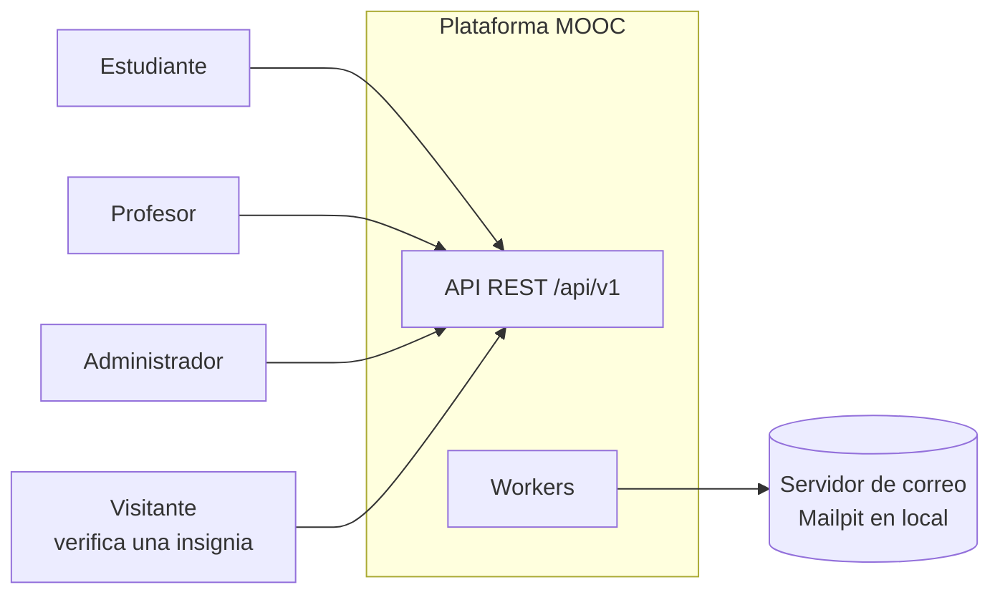
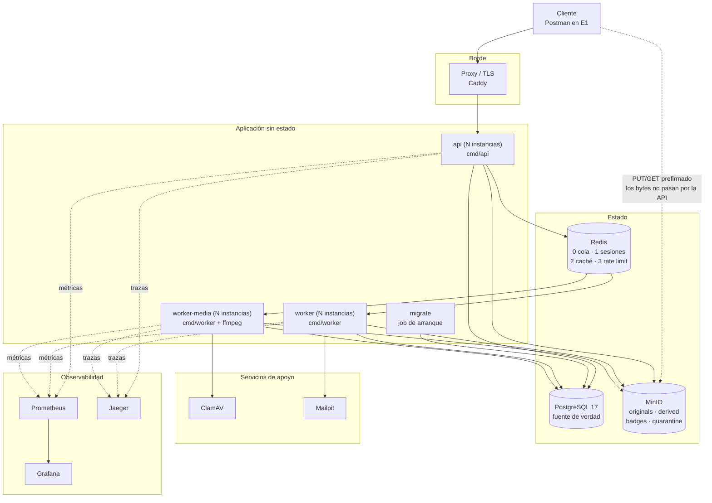

# Contexto y componentes

## Contexto

En la Entrega 1 los tres roles interactúan mediante **Postman**; el frontend
llega en la Entrega 2.

## Componentes

Comparar con `../recursos/diagrama-enunciado.png`: es el mismo esquema, con los
servicios de apoyo y observabilidad que el enunciado exige en otras secciones.

## Módulos del monolito

Frontera lógica del ADR-0001. Un módulo solo llama a otro por su interfaz de
servicio; nunca por sus tablas.

| Módulo | Responsabilidad | Depende de |
| --- | --- | --- |
| `identity` | Registro, verificación, login, sesiones, contraseñas | `audit`, cola (correo) |
| `admin` | Usuarios, roles, estados, sesiones ajenas, configuración | `identity`, `audit` |
| `authoring` | Cursos, versiones, módulos, unidades, recursos, publicación | `media`, `assessment`, `audit` |
| `media` | Assets, carga multipart, escaneo, transcodificación, URLs firmadas | cola, `audit` |
| `assessment` | Quizzes, intentos, calificación | `authoring` (solo lectura vía servicio) |
| `catalog` | Búsqueda, filtros, ficha pública del curso | `authoring` (lectura) |
| `enrollment` | Inscripción, retiro, reinscripción | `catalog`, `progress` |
| `progress` | Evidencias, cálculo, estados de la inscripción | `authoring`, `assessment`, cola (insignia) |
| `badges` | Emisión, verificación pública, revocación | `progress`, `media`, cola |
| `audit` | Registro inmutable de eventos | — |

Dependencias que serían circulares se rompen con un evento en la cola. Por
ejemplo, `progress` no llama a `badges`: encola `badge.issue`.

## Cómo se escala

La API **no publica puerto propio**: la única entrada es el proxy, que resuelve
`api` por DNS de Docker y reparte por turnos entre las instancias. Sin eso,
`--scale api=3` chocaría por el puerto del host.

| Componente | Cómo | Límite |
| --- | --- | --- |
| `api` | `--scale api=N` tras el proxy | El pool de conexiones a PostgreSQL |
| `worker` | `--scale worker=N` | Contención en `job_runs`, despreciable |
| `worker-media` | `--scale worker-media=N` | CPU de la máquina |
| PostgreSQL | Vertical; réplica de lectura en GCP | Fuente de verdad, no se reparte |
| Redis | Una instancia con AOF | Suficiente a esta escala |

Nada guarda estado en el proceso: ni caché local, ni sesiones, ni ficheros que
sobrevivan a la petición o al job (ADR-0001, ADR-0006).

## Servicios de Docker Compose

| Servicio | Imagen | Perfil |
| --- | --- | --- |
| `proxy` | `caddy:2-alpine` | por defecto |

| `api` | construida (`target: api`) | por defecto |
| `worker` | construida (`target: worker`) | por defecto |
| `worker-media` | construida (`target: worker-media`, con ffmpeg) | por defecto |
| `migrate` | construida (`target: migrate`) | por defecto, `restart: no` |
| `postgres` | `postgres:17-alpine` | por defecto |
| `redis` | `redis:7-alpine` (`--appendonly yes`) | por defecto |
| `minio` | `minio/minio` | por defecto |
| `minio-init` | `minio/mc` (crea buckets y políticas) | por defecto, `restart: no` |
| `mailpit` | `axllent/mailpit` | por defecto |
| `clamav` | `clamav/clamav` | por defecto |
| `prometheus` | `prom/prometheus` | `observability` |
| `grafana` | `grafana/grafana-oss` | `observability` |
| `jaeger` | `jaegertracing/all-in-one` | `observability` |
| `k6` | `grafana/k6` | `carga` |

Orden de arranque por healthcheck: `postgres`+`redis`+`minio` → `migrate` →
`api`/`worker`. `clamav` bloquea solo a `worker-media`.
