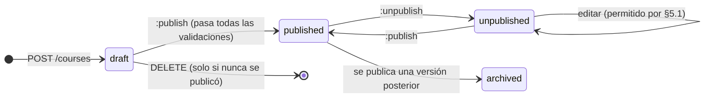
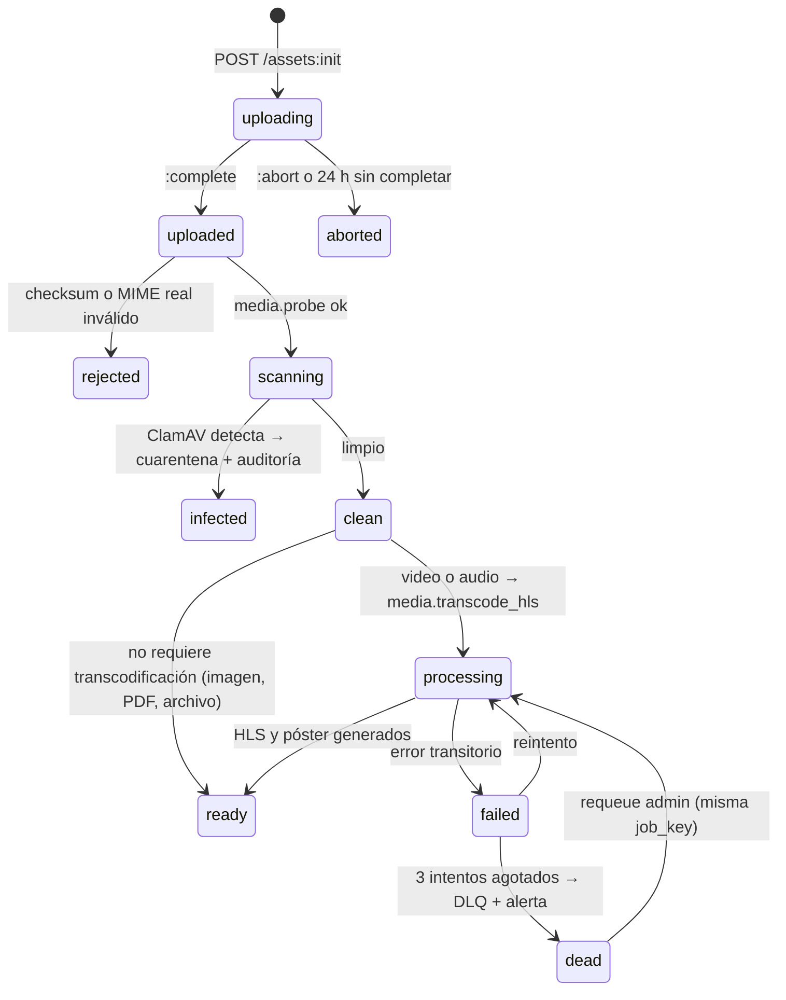
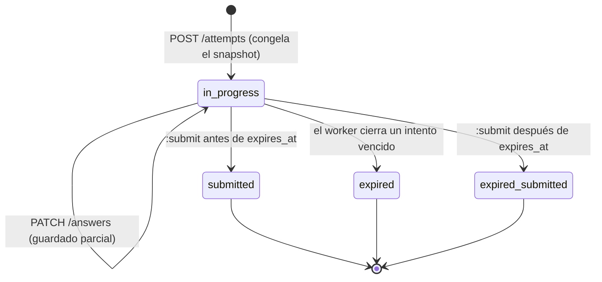
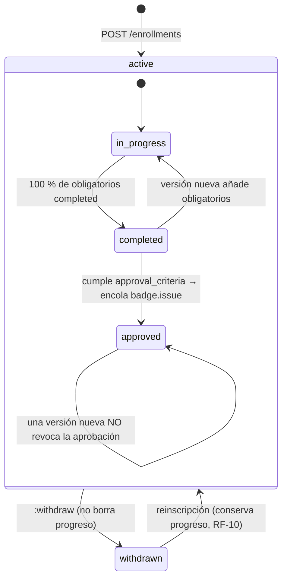
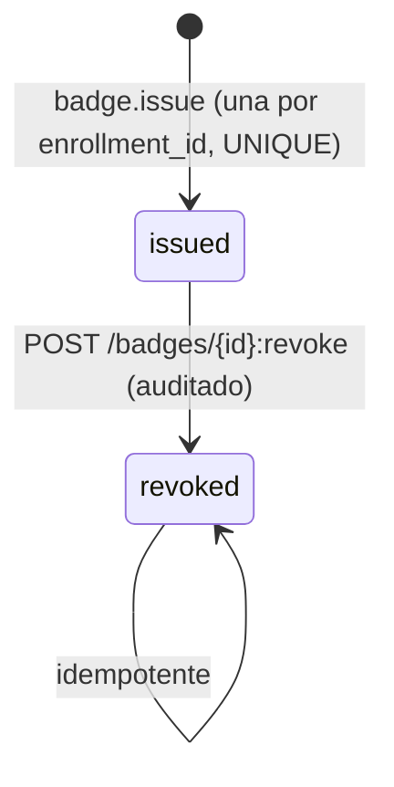

# Máquinas de estado

Las cinco transiciones que concentran las reglas de negocio del proyecto. Toda
transición inválida responde `409 conflict`, nunca modifica en silencio.

## Curso y versión (ADR-0007)

- `published` es **inmutable**: trigger en PostgreSQL sobre módulos, unidades,
  recursos, quizzes, preguntas y opciones.
- Publicar la versión N+1 archiva la N y actualiza `courses.current_version_id`.
- `unpublished` bloquea inscripciones nuevas; las existentes y su progreso se
  conservan.

## Asset de medios (ADR-0011)

Un recurso **visible** cuyo asset no esté `ready` bloquea la publicación
(`CA-01`).

## Intento de quiz (ADR-0013)

- Un solo intento `in_progress` por quiz y estudiante (índice único parcial).
- `expired_submitted` **se califica** con lo guardado antes de expirar: se prefiere
  puntuar el trabajo hecho a descartarlo.
- `:submit` es idempotente por `Idempotency-Key`; reenviar devuelve la misma nota.

## Inscripción y progreso (ADR-0012)

La última transición es una decisión de negocio explícita del ADR-0007: aprobar
es un hecho histórico contra la versión que se cursó, registrada en
`enrollments.approved_version_id`.

## Insignia (`CA-07`)

- Doble protección: `job_key` determinista **y** `UNIQUE (enrollment_id)`.
- `GET /verify/{public_code}` es pública y no expone el correo del estudiante.
- Una insignia revocada sigue siendo consultable; la respuesta indica
  `"status": "revoked"` con la fecha. Se prefiere transparencia a un `404`.
