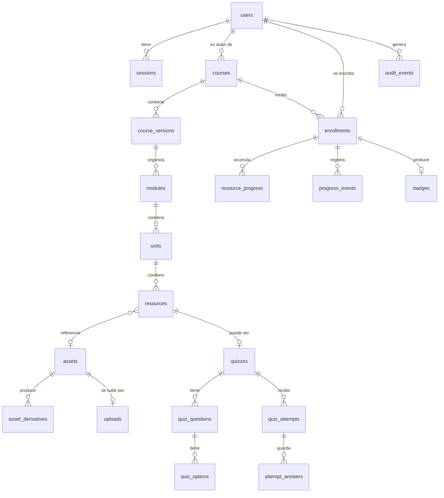

# Modelo de datos

Un esquema de PostgreSQL por módulo (ADR-0003). Todos los identificadores son
`uuid` v7 generados en la aplicación; todas las marcas de tiempo son
`timestamptz` en UTC.

## Diagrama

## `identity`

### `users`
| Columna | Tipo | Notas |
| --- | --- | --- |
| `id` | uuid PK | |
| `email` | citext | `UNIQUE` |
| `email_verified_at` | timestamptz null | Sin esto no se puede iniciar sesión |
| `password_hash` | text | Argon2id (ADR-0006) |
| `full_name` | text | |
| `role` | text | `admin` \| `teacher` \| `student` |
| `status` | text | `active` \| `suspended` \| `deleted` |
| `created_at`, `updated_at` | timestamptz | |

- Índice parcial `UNIQUE (role) WHERE role='admin' AND status='active'` **no**
  sirve para proteger al último administrador (impediría tener varios). La
  protección es una regla de servicio más un `CHECK` por trigger: suspender o
  degradar al último `admin` activo lanza excepción (`RF-02`).

### `sessions`
Espejo para listado y auditoría; Redis manda sobre la validez (ADR-0006).

| Columna | Tipo | Notas |
| --- | --- | --- |
| `id` | uuid PK | |
| `user_id` | uuid FK | |
| `token_sha256` | bytea | `UNIQUE`. Nunca el token en claro |
| `ip`, `user_agent` | text | |
| `created_at`, `last_seen_at`, `expires_at` | timestamptz | |
| `revoked_at`, `revoked_by` | timestamptz, uuid null | |

### `one_time_tokens`
Verificación de correo y restablecimiento de contraseña.

`id`, `user_id`, `purpose` (`email_verify` \| `password_reset`), `token_sha256`
(`UNIQUE`), `expires_at`, `consumed_at`.

## `authoring`

### `courses`
`id`, `slug` (`UNIQUE`), `title`, `summary`, `category`, `language`,
`cover_asset_id`, `owner_id` FK→`users`, `status` (`draft`|`published`|`unpublished`|`archived`),
`current_version_id`, `created_at`, `updated_at`.

### `course_versions`
`id`, `course_id` FK, `version_number` int, `status`
(`draft`|`published`|`unpublished`|`archived`), `approval_criteria` jsonb,
`published_at`, `published_by`, `created_at`.

- `UNIQUE (course_id, version_number)`.
- `approval_criteria`: `{"required_completion_pct": 100, "min_quiz_score": 70}`.
- Trigger `prevent_published_mutation` en esta tabla y en sus descendientes
  (ADR-0007).

### `modules` / `units` / `resources`
Los tres comparten la forma:

| Columna | Notas |
| --- | --- |
| `id` | uuid PK, cambia en cada versión |
| `stable_id` | uuid, **identidad pedagógica**; se copia al clonar (ADR-0007) |
| `course_version_id` | denormalizado también en `units` y `resources` para el trigger y para `UNIQUE (course_version_id, stable_id)` |
| padre (`course_version_id` / `module_id` / `unit_id`) | FK `ON DELETE CASCADE` |
| `position` | int, `UNIQUE (padre, position) DEFERRABLE` para poder reordenar en una transacción |
| `title` | text |

`resources` añade:

| Columna | Notas |
| --- | --- |
| `type` | `rich_text` \| `image` \| `video` \| `audio` \| `pdf` \| `slides` \| `download` \| `iframe` \| `link` \| `quiz` |
| `visible` | bool |
| `required` | bool — solo los `required AND visible` cuentan para el progreso |
| `downloadable` | bool |
| `content_md` | text null — Markdown canónico (ADR-0014) |
| `asset_refs` | uuid[] — extraído al normalizar, valida la publicación |
| `asset_id` | uuid null FK→`media.assets` |
| `external_url` | text null — `link` e `iframe`; se valida contra lista blanca |
| `processing_status` | derivado del asset: `n/a` \| `pending` \| `processing` \| `ready` \| `failed` |

### `content_revisions`
Últimas 20 revisiones de `content_md` por recurso, para la recuperación de
`RF-04`. `id`, `resource_id`, `content_md`, `author_id`, `created_at`.

## `media`

### `assets`
| Columna | Notas |
| --- | --- |
| `id` | uuid PK |
| `owner_id` | uuid FK→`users` |
| `kind` | `video` \| `audio` \| `image` \| `pdf` \| `slides` \| `file` |
| `original_key` | text — clave determinista en `mooc-originals` (ADR-0005) |
| `original_filename`, `declared_mime`, `detected_mime` | text |
| `size_bytes` | bigint |
| `sha256` | bytea — recalculado por el servidor, no el declarado |
| `duration_seconds`, `width`, `height` | null salvo audio/video |
| `status` | `uploading`→`uploaded`→`scanning`→`clean`→`processing`→`ready`, más `rejected`, `infected`, `failed` |
| `scan_result`, `scanned_at` | |
| `created_at`, `updated_at` | |

### `uploads`
Carga multipart en curso. `id`, `asset_id`, `s3_upload_id`, `part_size`,
`total_parts`, `parts_received` jsonb, `expires_at` (24 h, `RNF-07`),
`completed_at`, `aborted_at`.

### `asset_derivatives`
`id`, `asset_id`, `kind` (`hls_master`|`hls_variant`|`poster`|`pdf`),
`variant` (`360p`…), `key`, `bytes`, `created_at`.
`UNIQUE (asset_id, kind, variant)`.

## `assessment`

### `quizzes`
`id`, `resource_id` FK (`UNIQUE`), `stable_id`, `max_attempts` int
(`0`=ilimitado), `time_limit_seconds` null, `pass_score` numeric,
`feedback_policy` (`none`|`score_only`|`correctness`|`full`), `shuffle` bool,
`partial_credit` bool.

### `quiz_questions`
`id`, `quiz_id`, `stable_id`, `position`, `statement_md`, `kind`
(`single`|`multiple`), `points` numeric, `explanation_md` null.

### `quiz_options`
`id`, `question_id`, `stable_id`, `position`, `text_md`, **`is_correct` bool**.

> `is_correct` **no aparece en ningún tipo de salida de la API** (ADR-0013). El
> tipo `OptionView` de Go no tiene el campo, y una prueba de contrato recorre las
> respuestas del flujo buscando la subcadena.

### `quiz_attempts`
| Columna | Notas |
| --- | --- |
| `id`, `quiz_stable_id`, `user_id`, `enrollment_id` | |
| `attempt_number` | int |
| `snapshot` | jsonb — preguntas y opciones congeladas, **sin la clave** |
| `status` | `in_progress` \| `submitted` \| `expired` \| `expired_submitted` |
| `started_at`, `expires_at`, `submitted_at` | |
| `score` | numeric null, 0–100 |
| `score_detail` | jsonb null — puntaje por pregunta |
| `grading_version` | int — permite recalificar de forma auditable |

Índice parcial `UNIQUE (quiz_stable_id, user_id) WHERE status='in_progress'`
(ADR-0008).

### `attempt_answers`
`attempt_id`, `question_stable_id`, `selected_option_stable_ids` uuid[],
`saved_at`. PK `(attempt_id, question_stable_id)` — guardar de nuevo sustituye.

## `progress`

### `enrollments`
| Columna | Notas |
| --- | --- |
| `id`, `user_id`, `course_id` | |
| `status` | `active` \| `withdrawn` |
| `state` | `in_progress` \| `completed` \| `approved` |
| `enrolled_at`, `withdrawn_at`, `completed_at`, `approved_at` | |
| `approved_version_id` | qué versión se cursó al aprobar (ADR-0007) |
| `progress_pct` | numeric — **calculado por el servidor**, materializado |

Índice parcial `UNIQUE (user_id, course_id) WHERE status='active'`.

### `resource_progress`
`enrollment_id`, `resource_stable_id`, `state` (`not_started`|`in_progress`|`completed`),
`dwell_ms_total` bigint, `last_position_seconds` numeric, `max_position_seconds`
numeric, `opened_at`, `completed_at`, `updated_at`.
PK `(enrollment_id, resource_stable_id)` — **`stable_id`**, para sobrevivir a una
versión nueva.

### `progress_events`
Evidencia cruda, append-only. `id`, `enrollment_id`, `resource_stable_id`,
`kind` (`open`|`heartbeat`|`close`), `position_seconds`, `server_ts`,
`client_ts`, `accepted` bool, `reject_reason` text null.

Se conservan 90 días. Las rechazadas también: son la evidencia de `CA-05`.

## `badges`

### `badges`
| Columna | Notas |
| --- | --- |
| `id` | uuid PK |
| `enrollment_id` | **`UNIQUE`** — una insignia por inscripción (`CA-07`, ADR-0008) |
| `user_id`, `course_id`, `course_version_id` | |
| `public_code` | text `UNIQUE`, 22 caracteres base62 aleatorios — es la URL pública |
| `image_key` | text en `mooc-badges` |
| `issued_at` | |
| `revoked_at`, `revoked_by`, `revocation_reason` | |

La respuesta de `GET /api/v1/verify/{public_code}` incluye nombre del estudiante,
curso, versión, fecha y estado. **Nunca el correo** (`CA-07`).

## `audit`

### `events`
`id`, `occurred_at`, `actor_id` null, `actor_role`, `action`, `entity_type`,
`entity_id`, `ip`, `user_agent`, `trace_id`, `metadata` jsonb.

Inmutable: trigger `BEFORE UPDATE OR DELETE` que lanza excepción, y el rol de
aplicación solo tiene `INSERT` y `SELECT` (ADR-0003).

Acciones auditadas: login, fallo de login, revocación de sesión, cambio de rol,
suspensión, publicación, despublicación, emisión y revocación de insignia,
`progress.tampering_attempt`, asset infectado, reencolado desde la DLQ.

## `platform`

### `idempotency_keys`
`key`, `user_id`, `endpoint`, `request_hash`, `status`, `response_status`,
`response_body`, `created_at`. `UNIQUE (user_id, endpoint, key)`. TTL 24 h
(ADR-0008).

### `job_runs`
`id`, `job_key` (**`UNIQUE`**), `type`, `status`
(`queued`|`running`|`succeeded`|`failed`|`dead`), `attempt`, `payload` jsonb,
`heartbeat_at`, `last_error`, `created_at`, `finished_at`.

Es a la vez el registro de idempotencia, la *outbox* y la DLQ (ADR-0004,
ADR-0008).

## Índices que importan

| Índice | Para qué |
| --- | --- |
| `courses (status, category, language)` + GIN sobre `to_tsvector(title||summary)` | Catálogo con búsqueda y filtros (`RF-10`) |
| `resources (course_version_id, required, visible)` | Cálculo de progreso |
| `resource_progress (enrollment_id)` | Recálculo por inscripción |
| `progress_events (enrollment_id, server_ts DESC)` | Cadencia de heartbeats |
| `job_runs (status, heartbeat_at) WHERE status='running'` | El `reaper` (ADR-0004) |
| `audit.events (entity_type, entity_id, occurred_at DESC)` | Consulta de auditoría |
| `enrollments (course_id) WHERE status='active'` | Conteo de inscritos |
