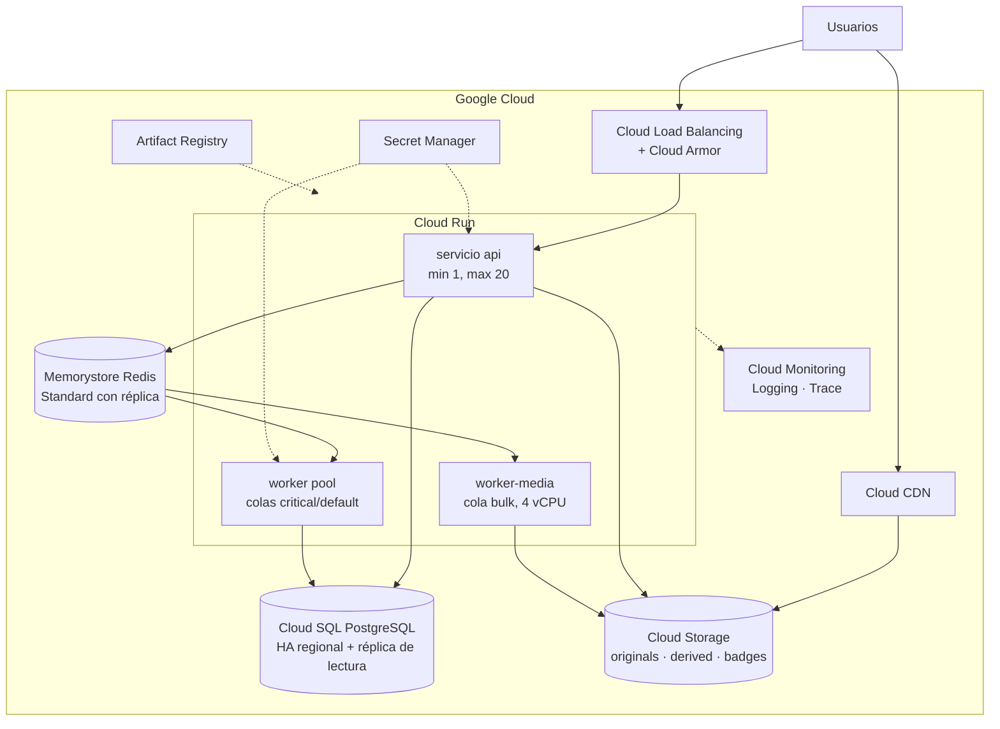

# Ruta a GCP

Plan para las entregas 3 y 4. **Nada de esto se implementa en la Entrega 1**
(ADR-0010): existe para que las decisiones de hoy no se paguen después.

## Arquitectura destino

## Equivalencias

| Local (E1) | GCP | Qué cambia en el código |
| --- | --- | --- |
| `api` en Compose | Cloud Run, escala automática | Escuchar en `$PORT`. Nada más |
| `worker` / `worker-media` | Cloud Run worker pools (o MIG si hace falta más CPU) | Nada |
| `migrate` | Cloud Run job en el despliegue | Nada (ADR-0003 ya lo separa) |
| `postgres` | Cloud SQL PostgreSQL 17, HA regional | Cadena de conexión + conector |
| `redis` | Memorystore for Redis Standard | Cadena de conexión + TLS |
| `minio` | Cloud Storage | Adaptador `gcs`, o el mismo adaptador S3 contra el endpoint de interoperabilidad XML |
| URL firmadas de MinIO | URL firmadas V4 de GCS, o **cookies firmadas de CDN** para HLS | Un solo paquete: `adapters/objectstore` |
| Servir HLS desde MinIO | Cloud CDN sobre bucket de respaldo | Emisión de credencial, no la lógica |
| `mailpit` | SendGrid o Cloud Run + SMTP | Adaptador `mailer` |
| `clamav` | ClamAV dentro de `worker-media`, o Cloud Run job | Nada |
| `jaeger` | Cloud Trace vía OTLP | Endpoint del exportador |
| `prometheus`/`grafana` | Cloud Monitoring + Managed Prometheus | Endpoint |
| `caddy` | Cloud Load Balancing + certificado gestionado | Nada |
| `.env` | Secret Manager inyectado como variable | Nada: solo `os.Getenv` |

## Lo que hay que resolver en E3

| Tema | Por qué no es trivial |
| --- | --- |
| **HLS por CDN** | Firmar cada segmento no escala tras un CDN. Se pasa a **cookies firmadas de Cloud CDN**, lo que exige emitir la cookie tras verificar la inscripción y acotar su alcance por prefijo de ruta |
| **Cloud Run y trabajos largos** | La transcodificación puede pasar del máximo cómodo de una instancia. O se parte el trabajo por segmentos, o `worker-media` va a un MIG |
| **Arranque en frío** | `min-instances: 1` en `api` para no pagar el arranque en el p95 |
| **Conexiones a Cloud SQL** | Cloud Run escala a muchas instancias y agota conexiones. Hace falta el conector con *pooling*, o PgBouncer |
| **Egreso a Memorystore** | Exige conector de VPC sin servidor; hay que presupuestarlo |
| **Costos** | Cloud CDN y el egreso de video dominan la factura. Medir con la métrica de transcodificación de E1 (§11) |
| **Copias de seguridad** | Cloud SQL automatiza copias y PITR; hay que **probar la restauración** igual, porque el RTO se demuestra, no se declara |

## Orden previsto

1. Artifact Registry y build de imágenes en CI.
2. Terraform: red, Cloud SQL, Memorystore, GCS, Secret Manager.
3. Job de migración y despliegue de `api` en Cloud Run.
4. Workers y colas.
5. CDN y cookies firmadas.
6. Observabilidad y alertas en Cloud Monitoring.
7. Prueba de carga y de recuperación sobre el entorno desplegado.

## Regla que no se rompe

**Docker Compose sigue siendo el entorno de desarrollo y el de la demostración
local.** Lo que corre en GCP debe poder correr en Compose con solo cambiar
variables de entorno. Si algún día no puede, se rompió el ADR-0010.
