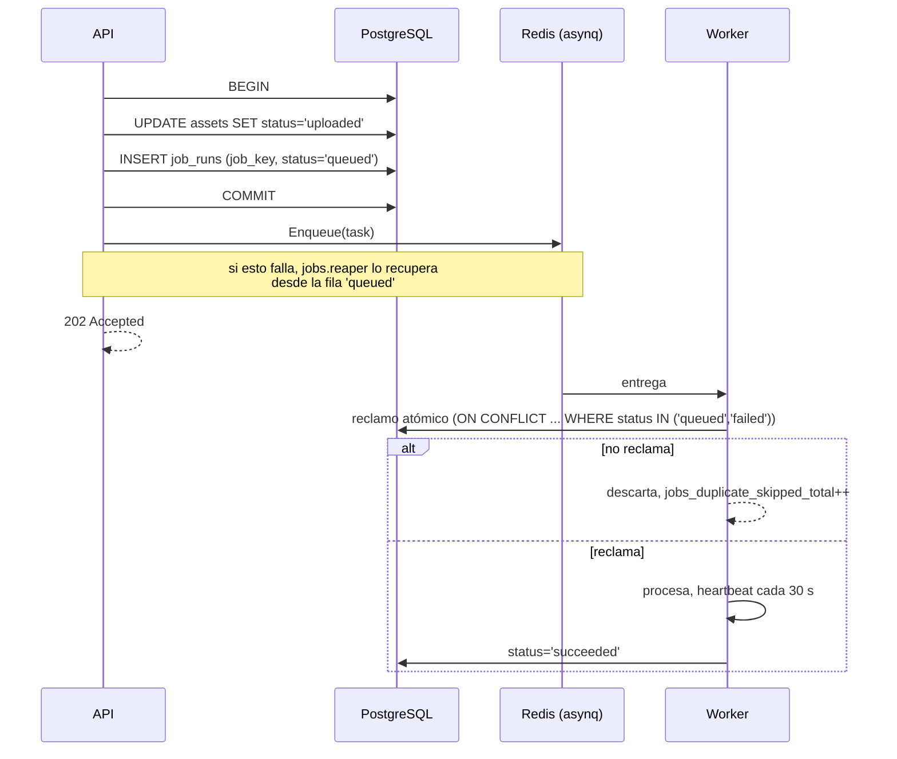
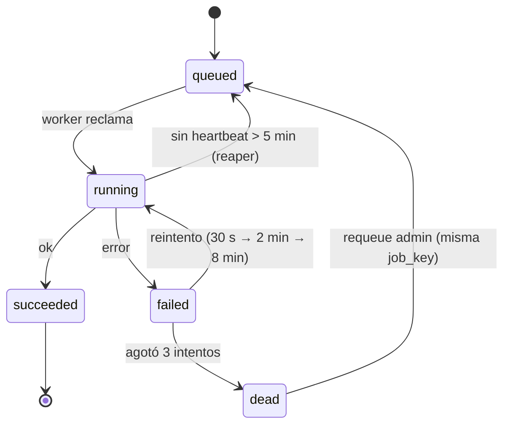

# Trabajos asíncronos

Implementación de las reglas del ADR-0004 y del ADR-0008.

## Catálogo de trabajos

| Tipo | Cola | `job_key` | Qué hace |
| --- | --- | --- | --- |
| `media.probe` | `default` | `media.probe:{asset_id}` | Recalcula SHA-256 desde el bucket, detecta MIME real por *magic bytes*, extrae duración y resolución con `ffprobe` |
| `media.scan` | `bulk` | `media.scan:{asset_id}` | ClamAV por INSTREAM. Infectado → `mooc-quarantine` + auditoría. Va en `bulk`, no en `default` como se planeó: lo ejecuta `worker-media`, el único que depende de clamd, para que un antivirus caído no detenga los correos de verificación |
| `media.transcode_hls` | `bulk` | `media.transcode_hls:{asset_id}:{ladder_version}` | FFmpeg → HLS sin *upscaling*. Conserva el original |
| `media.poster` | `bulk` | `media.poster:{asset_id}` | Fotograma del segundo 3 como JPEG |
| `doc.convert_pdf` | `bulk` | `doc.convert_pdf:{asset_id}` | PPTX/ODP → PDF (`RO-01`, opcional) |
| `badge.issue` | `critical` | `badge.issue:{enrollment_id}` | Genera la imagen PNG, crea la fila única, publica la URL |
| `email.send` | `critical` | `email.send:{template}:{user_id}:{token_id}` | Verificación, invitación de profesor, restablecimiento |
| `progress.recompute` | `default` | `progress.recompute:{enrollment_id}:{version_id}` | Recalcula el progreso tras publicar una versión |
| `assessment.expire_attempts` | `default` | programado | Cierra intentos vencidos que nadie envió |
| `media.sweep_uploads` | `default` | programado | Aborta multipart con más de 24 h |
| `jobs.reaper` | `critical` | programado | Reencola `running` sin heartbeat y `queued` que nunca llegaron a asynq |

Programados con el `Scheduler` de asynq: `jobs.reaper` cada minuto,
`assessment.expire_attempts` cada minuto, `media.sweep_uploads` cada hora,
poda de `job_runs`, `progress_events` e `idempotency_keys` cada día.

## Encolado (patrón *outbox*)



El cambio de dominio y el registro del trabajo entran en **la misma
transacción**. Redis puede perder datos sin que se pierda el trabajo, que es lo
que advierte el enunciado §11.

## Reintentos y DLQ



- `MaxRetry = 3`, backoff exponencial con jitter (`RNF-06`).
- Al morir: fila `dead` en `job_runs`, `jobs_dead_letter_total{type}++`,
  alerta `increase(jobs_dead_letter_total[5m]) > 0`, evento de auditoría.
- `POST /admin/jobs/{id}:requeue` reencola **con la misma `job_key`**, que es lo
  que pide SEG-4 literalmente.

## Errores permanentes frente a transitorios

No todo se reintenta. El worker distingue:

| Clase | Ejemplos | Acción |
| --- | --- | --- |
| Transitorio | Red, `503` de S3, bloqueo de base | Reintenta con backoff |
| Permanente | MIME no soportado, archivo corrupto, asset infectado, entidad borrada | `asynq.SkipRetry`: va directo a `dead` sin gastar tres intentos |

Reintentar tres veces un PDF corrupto solo retrasa el diagnóstico.

## Payload de un trabajo

```json
{
  "job_key": "media.transcode_hls:018f...:v1",
  "asset_id": "018f...",
  "ladder_version": "v1",
  "traceparent": "00-4bf92f...-00f067aa0ba902b7-01",
  "enqueued_at": "2026-09-05T15:04:05Z"
}
```

`traceparent` es lo que hace que la transcodificación aparezca en Jaeger como
hija de la petición que subió el archivo (ADR-0009). Sin él, SEG-4 no puede
mostrar el recorrido completo.

## Fallos inyectables para la demostración

Variables de entorno del worker; existen solo para SEG-4 y se documentan en la
colección de Postman.

| Variable | Efecto |
| --- | --- |
| `FAIL_TRANSCODE=1` | `media.transcode_hls` falla siempre → backoff, DLQ, alerta |
| `FAIL_TRANSCODE_TIMES=2` | Falla dos veces y luego funciona → demuestra el backoff sin llegar a DLQ |
| `SLOW_TRANSCODE_SECONDS=120` | Alarga el trabajo → permite mostrar heartbeats y el `reaper` |
| `DUPLICATE_DELIVERY=1` | Encola dos veces el mismo trabajo → una sola salida |

## Escalado de workers

Los tres binarios de worker son el mismo código con distinta configuración de
colas:

| Servicio | Colas | Concurrencia | Por qué |
| --- | --- | --- | --- |
| `worker` | `critical`, `default` | 20 | Trabajos cortos, ligados a E/S |
| `worker-media` | `bulk` | 2 por instancia | FFmpeg satura CPU; más concurrencia solo alarga todo |

Escalar medios es `--scale worker-media=N`, no subir la concurrencia.
