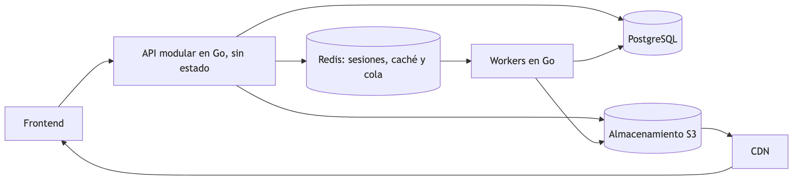

# Enunciado — Plataforma web de cursos masivos abiertos en línea

> Transcripción fiel del PDF `2026-20 proyecto-plataforma-mooc.pdf` (7 páginas,
> 23 de agosto de 2026). Se conserva la numeración original para poder citarla.
> Si algo aquí discrepa del PDF, manda el PDF.

## Ficha

| Campo | Valor |
| --- | --- |
| Curso | Cloud |
| Producto | Plataforma MOOC |
| Tipo de trabajo | Proyecto de desarrollo de una plataforma web |
| Horizonte del MVP | 4 a 5 entregas en 13 semanas |
| Equipo | 4 personas |
| Backend | Go, monolito modular y workers independientes |
| Frontend | Tecnología de preferencia de los estudiantes |
| Despliegue | Docker y Docker Compose, con escalamiento a múltiples instancias |
| Inteligencia artificial | Se permite su uso total para el desarrollo del producto |
| Validación | Tests automáticos y pruebas de carga |

## 1. Propósito

Construir una plataforma web de cursos masivos abiertos en línea, operada por una
única organización, que conserve el control sobre el contenido, los datos de los
estudiantes, la marca y la evolución del producto. La solución permite a
profesores autorizados crear cursos estructurados con recursos multimedia y
evaluaciones de selección múltiple, y a estudiantes registrarse, inscribirse,
aprender de manera autodirigida y asíncrona, presentar evaluaciones y obtener
insignias digitales verificables.

El sistema debe atender inicialmente hasta **50.000 usuarios registrados** y
**2.000 usuarios concurrentes**.

## 2. La tarea central

Implementar una plataforma MOOC con tres roles globales: **administrador**,
**profesor** y **estudiante**.

- Los profesores organizan contenidos mediante la jerarquía
  Curso → Módulo → Unidad → Recurso.
- Los estudiantes consultan el catálogo, se inscriben, consumen contenido,
  presentan quizzes y reciben una insignia al aprobar.
- Los administradores gestionan cuentas, auditoría y configuraciones
  transversales.

El flujo esperado integra autoría y publicación versionada, carga directa de
archivos, procesamiento multimedia asíncrono, reproducción HLS, calificación en
servidor, progreso validado y emisión idempotente de insignias con URL pública de
verificación. La operación incorpora control de acceso, auditoría y
observabilidad transversal.

## 3. La estructura académica

Un curso es el agregado raíz de autoría y contiene versiones numeradas. Cada
versión organiza módulos, unidades y recursos mediante posiciones ordenadas e
**identificadores estables**, necesarios para preservar el progreso cuando se
publica una actualización.

- Curso con metadatos, estado y versión vigente.
- Módulos ordenados dentro de la versión.
- Unidades ordenadas dentro de cada módulo.
- Recursos visibles u ocultos, obligatorios u opcionales.

Estructura mínima de contenido publicable:

```
Curso
└── Módulo
     └── Unidad
          └── Recurso visible y disponible
```

Los recursos admitidos son: **texto enriquecido, imagen, video, audio, PDF,
presentación, archivo descargable, iframe autorizado, enlace externo y quiz**.
Cada recurso define título, orden, visibilidad, posibilidad de descarga,
obligatoriedad y estado de procesamiento cuando aplica.

El contenido textual se persiste como **Markdown extendido canónico**; los
binarios se conservan **exclusivamente en almacenamiento de objetos**. Una
versión publicada es **inmutable** y toda edición posterior se realiza sobre un
borrador de actualización, con continuidad del progreso mediante los
identificadores estables.

## 4. Arquitectura requerida

Monolito modular en Go con workers asíncronos independientes, un frontend con
tecnología de libre elección y servicios para persistencia, distribución y
observabilidad.



El diagrama del enunciado muestra: `Frontend → API modular en Go (sin estado)`;
la API escribe en `PostgreSQL`, en `Redis (sesiones, caché y cola)` y en
`Almacenamiento S3`; los `Workers en Go` consumen de Redis y escriben en
PostgreSQL y en S3; el `CDN` sirve desde S3 hacia el frontend.

### Reglas de arquitectura obligatorias

- La API y los workers **no mantienen estado local** y escalan horizontalmente.
- **PostgreSQL** constituye la fuente de verdad transaccional; **Redis** soporta
  sesiones, caché, rate limiting y la cola **asynq**.
- Los archivos originales, derivados HLS, PDF convertidos e imágenes de insignias
  se almacenan **fuera de la base relacional**.
- La API publica trabajos y eventos; los workers consumen con **idempotencia,
  reintentos con backoff y dead-letter queue**.
- El frontend se comunica con la API mediante **REST JSON sobre HTTPS** y los
  binarios se cargan o descargan mediante **URLs prefirmadas**.
- El sistema completo se ejecuta con **Docker y Docker Compose**; la API y los
  workers pueden escalar a múltiples instancias.

## 5. Alcance funcional

### 5.1 Alcance mínimo obligatorio

1. Registro público de estudiantes con verificación de correo, sesiones
   revocables y recuperación; los profesores solo se crean por administración.
2. Gestión administrativa de usuarios, roles, estados, sesiones y auditoría,
   protegiendo al último administrador activo.
3. Autoría de cursos con metadatos, jerarquía de cuatro niveles, ordenamiento,
   previsualización, estados y versiones publicadas inmutables.
4. Editor de bloques con autosave, recuperación y Markdown extendido canónico
   para el subconjunto del MVP.
5. Carga multipart directa a objetos, reanudable durante 24 horas, con
   verificación de integridad, MIME real y escaneo antimalware.
6. Procesamiento asíncrono de video y audio a HLS, conservación del original,
   idempotencia y distribución por CDN.
7. Visor PDF y reproducción adaptativa de video o audio desde la última posición
   reportada.
8. Quizzes de selección múltiple con intentos, guardado parcial, calificación en
   servidor y retroalimentación configurable.
9. Progreso validado por servidor, finalización, aprobación e insignias únicas
   con imagen y URL verificable.
10. Catálogo con búsqueda y filtros, inscripción, retiro y reinscripción
    conservando progreso y resultados.

El MVP incluye observabilidad básica, auditoría, despliegue productivo y pruebas
de los flujos críticos. **La edición de un curso publicado exige despublicarlo
temporalmente durante esta fase.**

### 5.2 Alcance opcional con valoración adicional

- Conversión de presentaciones PPTX y ODP a PDF con previsualización.
- Iframes restringidos mediante lista blanca, sandbox y política de permisos.
- Editor completo con tablas, fórmulas, tareas e historial visible de revisiones.
- Borradores de actualización con clasificación de cambios y migración de
  progreso.
- Panel administrativo con métricas y resultados agregados por quiz.
- Coautoría básica, exportación de datos personales e internacionalización.
- Subtítulos, transcripciones, foros asíncronos y Open Badges 3.0.

## 6. Condiciones verificables

Fundamentan la aceptación y deben demostrarse mediante pruebas reproducibles.

- **Publicación válida.** Un curso solo se publica con metadatos completos,
  estructura mínima, criterios de aprobación y todos los recursos visibles
  disponibles.
- **Procesamiento asíncrono.** Una carga multimedia se realiza directamente al
  almacenamiento; el worker produce HLS sin bloquear la API y conserva el
  original.
- **Tolerancia a fallos.** Una entrega duplicada no genera salidas repetidas;
  tras tres reintentos fallidos, el trabajo llega a la DLQ y emite una alerta.
- **Integridad del quiz.** La clave correcta nunca llega al cliente, el envío
  definitivo es idempotente y la calificación se calcula en el servidor.
- **Progreso verificable.** Heartbeats, permanencia y eventos de apertura
  determinan el avance; porcentajes enviados por el cliente se rechazan y
  auditan.
- **Control de acceso.** Cada endpoint respeta rol, propiedad e inscripción; los
  materiales privados se entregan con URLs firmadas después de verificar el
  derecho de acceso.
- **Emisión de insignia.** Al alcanzar el estado `approved`, se crea una única
  insignia verificable sin exponer el correo del estudiante.

## 7. Restricciones técnicas

- El backend usa **Go** como monolito modular, con dominio desacoplado del
  framework HTTP y del proveedor cloud.
- El frontend emplea la tecnología que los estudiantes determinen y se integra
  con la API mediante HTTPS.
- **PostgreSQL** almacena transacciones; **Redis** soporta sesiones, caché,
  límites y cola; ningún binario reside en la base relacional.
- Todos los componentes se ejecutan en **Docker**; el entorno local incluye
  **MinIO** y **Mailpit** mediante Docker Compose.
- La API REST usa `/api/v1`, **OpenAPI 3.1**, errores uniformes, cursores,
  `ETag` e `Idempotency-Key`.
- La solución cumple **WCAG 2.2 AA**, **OpenTelemetry**, **TLS 1.2+**, cifrado en
  reposo y gestión externa de secretos.

## 8. Entregables

1. Repositorio con frontend, backend, workers, migraciones, pruebas y OpenAPI.
2. Plataforma contenedorizada con Docker y Docker Compose, preparada para
   múltiples instancias.
3. Evidencia de flujos críticos, seguridad, rendimiento, accesibilidad,
   observabilidad y recuperación.

## 9. Criterios de evaluación

Siete criterios derivados de los requerimientos Must y Should.

| Criterio | Prioridad | Qué se evalúa |
| --- | --- | --- |
| Arquitectura y despliegue | Must | Monolito modular en Go, API y workers sin estado, persistencia externa, Docker y Docker Compose, escalamiento a múltiples instancias y recuperación con **RPO ≤ 15 min** y **RTO ≤ 4 h**. |
| Identidad, autorización y seguridad | Must | Registro y sesiones seguras, administración de roles, control por propiedad e inscripción, auditoría inmutable, protección CSRF/XSS, límites de tasa, carga antimalware, cifrado y secretos externos. |
| Autoría y publicación | Must | Jerarquía académica ordenada, editor con Markdown extendido, autosave, previsualización, validaciones de publicación, versiones inmutables e identificadores estables para conservar progreso. |
| Multimedia y distribución | Must | Carga multipart directa y reanudable, transcodificación HLS idempotente, reintentos y DLQ, conservación de originales, CDN, URLs firmadas y visor PDF accesible. |
| Evaluación académica | Must | Autoría de quizzes, guardado parcial, snapshots, clave exclusiva del servidor, calificación reproducible, intentos idempotentes, expiración y retroalimentación conforme a la política configurada. |
| Progreso e insignias | Must | Evidencias de avance verificadas en servidor, cálculo sobre recursos obligatorios, preservación ante actualizaciones, aprobación por criterios definidos e insignia única, pública y revocable. |
| Calidad operativa | Must/Should | Objetivos de latencia y disponibilidad, pruebas unitarias, integración y E2E, accesibilidad WCAG 2.2 AA, compatibilidad, logs, métricas, trazas, alertas y pruebas de recuperación. |

**Escala por criterio.** Un criterio obligatorio se considera cumplido cuando sus
condiciones de aceptación son reproducibles, los controles de seguridad y
tolerancia a fallos operan frente a casos adversos y las métricas aplicables
alcanzan los umbrales documentados. Los elementos Should amplían la calidad sin
reemplazar ningún requisito Must.

## 10. Especificación de la demostración de aceptación

La evidencia debe permitir verificar cada criterio mediante el sistema
desplegado, sus pruebas automatizadas y los registros de observabilidad. **Un
comportamiento que no pueda reproducirse ni observarse no acredita el requisito
correspondiente, aunque exista código asociado.**

> **Condición de aceptación.** Los nueve flujos críticos deben superar pruebas
> E2E; la prueba de carga de Etapa 1 y la auditoría automática de accesibilidad
> no pueden presentar incumplimientos críticos.

### 10.1 Requisitos formales

- La demostración se ejecuta con **datos sintéticos** sobre el sistema desplegado
  mediante Docker Compose.
- La evidencia incluye respuesta de la API, comportamiento de la interfaz, estado
  persistido y trazas o logs correlacionados cuando aplique.
- Las pruebas cubren roles, propiedad, idempotencia, fallos inyectados y límites
  de rendimiento documentados.
- El pipeline de CI debe completar build, lint, análisis de seguridad,
  migraciones y pruebas antes de la demostración.

### 10.2 Estructura recomendada

| # | Segmento | Evidencia principal | Criterio | Qué debe verificarse |
| --- | --- | --- | --- | --- |
| 1 | Identidad y administración | Pruebas de rol y sesión | Identidad, autorización y seguridad | Registro de estudiante, invitación de profesor, revocación inmediata de sesiones, suspensión auditada y rechazo de operaciones no autorizadas. |
| 2 | Autoría y publicación | Flujo E2E de curso | Autoría y publicación | Creación del borrador, módulos, unidades y recursos; previsualización; lista exhaustiva de errores; publicación de una versión inmutable. |
| 3 | Carga multimedia | Carga multipart interrumpida | Multimedia y distribución | URLs prefirmadas, reanudación, checksum, validación MIME, escaneo antimalware, encolamiento y conservación del original. |
| 4 | Procesamiento y fallos | Worker y observabilidad | Arquitectura, multimedia, calidad operativa | Estados del recurso, HLS sin upscaling, doble entrega idempotente, backoff, DLQ, alerta y reencolado con la misma clave. |
| 5 | Consumo de contenido | Navegación de estudiante | Multimedia, progreso y accesibilidad | Inscripción, streaming adaptativo, reanudación de reproducción, visor PDF, navegación por teclado y entrega autorizada mediante CDN. |
| 6 | Quiz | Intento completo e interrumpido | Evaluación académica | Snapshot, guardados parciales, ausencia de claves correctas en el cliente, envío idempotente, expiración y cálculo de la nota. |
| 7 | Progreso y aprobación | Señales legítimas y fraudulentas | Progreso e insignias | Heartbeats, permanencia mínima, rechazo de manipulación, porcentaje de obligatorios, transición a `completed` y `approved`. |
| 8 | Insignia y actualización | Verificación pública y nueva versión | Autoría, progreso e insignias | Emisión única, URL sin correo, revocación auditada, `stable_id` y conservación del progreso. |
| 9 | Operación | Prueba de carga y recuperación | Arquitectura y calidad operativa | p95, escalamiento, observabilidad, fallos, backup, restauración y RTO/RPO. |

### 10.3 Cobertura de las condiciones verificables

Las condiciones de la sección 6 deben aparecer en los segmentos correspondientes.
La aceptación recorre la tabla de la sección 10.2 y contrasta cada evidencia con
los criterios de la sección 9, las reglas de negocio, los objetivos no
funcionales y los registros producidos por el sistema.

## 11. Recomendaciones

- Prototipar durante las dos primeras semanas la **biyección entre el AST del
  editor y Markdown extendido**, con pruebas de ida y vuelta bloqueantes por tipo
  de nodo.
- Medir desde el MVP el **costo por minuto de transcodificación** y el tiempo de
  disponibilidad de video para decidir si se mantiene FFmpeg o se adopta un
  servicio gestionado.
- Mantener **Postgres como fuente de verdad** y reencolar trabajos sin heartbeat
  para mitigar pérdidas en Redis.
- Validar presentaciones con un corpus real, ejecutar game days trimestrales y
  revisar jurisdicción, retención y titularidad del contenido.
