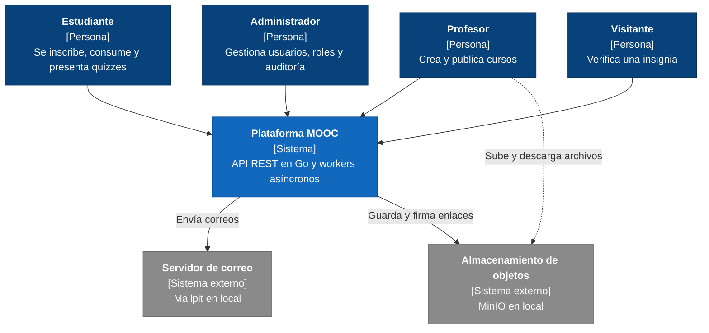
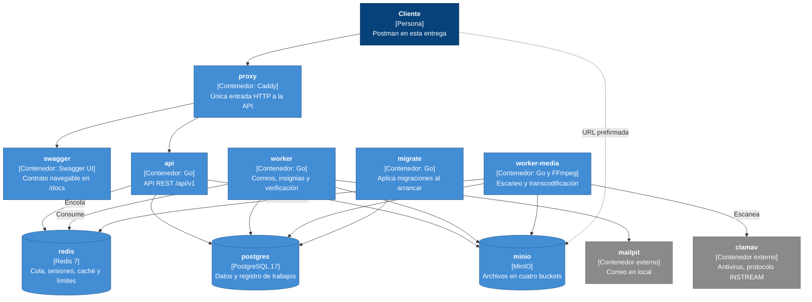

# Informe de arquitectura. Entrega 1

Santiago Chica Castano, Josue Briceño Urquijo, Daniel Alfredo Reales Paba y
Michael Javier Patiño Pantoja.

Plataforma MOOC operada por una sola organización. Backend y workers en Go sobre
Docker Compose, sin frontend.

## 1. Introducción y objetivos

La plataforma publica cursos masivos abiertos. Un profesor crea y publica el
curso. Un estudiante se inscribe, lo consume, presenta quizzes y obtiene una
insignia verificable al aprobar. Debe atender 50.000 usuarios registrados y
2.000 concurrentes.

### Alcance de esta entrega

Esta entrega construye el backend y los workers en Go sobre Docker Compose, sin
frontend. Postman sirve de interfaz para probar el sistema.

| Área | Qué se entrega |
| --- | --- |
| Identidad y administración | Registro con verificación, sesiones revocables, roles, estados y auditoría |
| Autoría | Jerarquía de contenido, validación y publicación de versiones inmutables |
| Multimedia | Carga multipart reanudable, verificación del archivo, escaneo antimalware y transcodificación a HLS |
| Consumo | Catálogo con búsqueda, inscripción, retiro y reinscripción sin perder el progreso |
| Evaluación | Quizzes con snapshot, guardado parcial, expiración y calificación |
| Progreso e insignias | Evidencias verificadas, aprobación e insignia única verificable |
| Operación | Escalado a varias instancias, métricas, alertas y CI |

El vídeo se grabó antes de terminar dos piezas que este informe ya cuenta como
entregadas, el escaneo antimalware y la transcodificación a HLS. Llegaron
después y se recorren con `make postman`.

### Contenido del documento

El documento sigue la plantilla arc42. Las secciones 2 a 4 dan las
restricciones, el contexto y la estrategia. Las secciones 5, 6 y 7 describen el
sistema por bloques, en ejecución y desplegado, y la 8 reúne los mecanismos
comunes. Las secciones 9 y 10 cubren las decisiones y la calidad con su
evidencia. La 11 recoge lo pendiente y la 12 los términos.

## 2. Restricciones

- Go, con monolito modular y dominio desacoplado del framework HTTP y del
  proveedor cloud.
- PostgreSQL como fuente de verdad transaccional. Redis para sesiones, caché,
  límites de tasa y cola.
- Ningún binario en la base relacional.
- Todo en Docker, con MinIO y Mailpit en local.
- API REST bajo `/api/v1` con OpenAPI 3.1, errores uniformes, cursores, `ETag`
  e `Idempotency-Key`.
- API y workers sin estado, escalables a varias instancias.
- Workers que consumen con idempotencia, reintentos con backoff y DLQ.
- WCAG 2.2 AA, OpenTelemetry, TLS 1.2+, cifrado en reposo y secretos externos.
- RPO menor o igual a 15 minutos y RTO menor o igual a 4 horas.

Compilar, probar y ejecutar ocurre dentro de contenedores.

## 3. Contexto y alcance

El diagrama de nivel 1 muestra la plataforma como una caja.

El visitante es el único que no inicia sesión. La plataforma depende de dos
sistemas externos. Un servidor de correo envía
verificaciones e invitaciones. Un almacenamiento de objetos compatible con S3
guarda los archivos.

La línea punteada es el único camino que no pasa por la API. Un vídeo puede
ocupar gigabytes, y hacerlo viajar por la API gastaría su memoria y su tiempo en
mover bytes. En su lugar la API firma un enlace temporal y el profesor sube o
descarga contra el almacenamiento. El enlace caduca y sirve solo para ese
archivo, así que el permiso lo sigue dando la API.

## 4. Estrategia de solución

| Decisión | ADR |
| --- | --- |
| Un módulo de Go, dos binarios, un paquete por dominio | ADR-0001 |
| `net/http` de la biblioteca estándar, sin framework | ADR-0002 |
| PostgreSQL 17 con migraciones SQL solo hacia adelante | ADR-0003 |
| Redis con asynq, colas por prioridad y registro del trabajo en la base | ADR-0004 |
| Puerto del dominio con adaptador S3. La versión para la nube sigue en revisión | ADR-0005, ADR-0015 |
| Sesiones con token opaco en Redis y revocación inmediata | ADR-0006 |
| Versiones publicadas inmutables e identificadores estables | ADR-0007 |
| Tres mecanismos de idempotencia, uno por capa | ADR-0008 |
| Errores RFC 9457 con `trace_id` y métricas Prometheus | ADR-0009 |

Todo lo externo pasa por un puerto del dominio (ADR-0010). El dominio no importa
el framework HTTP, el cliente de la base ni el SDK del proveedor.
`scripts/arquitectura.sh` comprueba esa regla y corre en el CI. En local entra
por `make arch`.

## 5. Vista de bloques

El diagrama de nivel 2 abre la caja de la plataforma. Cada bloque es un
contenedor que corre hoy.

- El cliente entra por `proxy`, que manda `/docs` a `swagger` y el resto a
  `api`. `migrate` crea el esquema al arrancar y termina.
- `api` atiende las peticiones REST. Guarda datos en `postgres`, sesiones y
  trabajos pendientes en `redis`, y firma enlaces contra `minio`.
- `worker` toma los trabajos de `redis`, registra el resultado en `postgres`,
  escribe archivos en `minio` y envía correos por `mailpit`.
- `worker-media` lleva FFmpeg y habla con `clamav`. Consume solo la cola `bulk`,
  donde viven el escaneo y la transcodificación, para que un trabajo de minutos
  no retrase un correo de verificación.
- La línea punteada es la subida y descarga directa contra `minio`.

Ningún contenedor de la aplicación guarda estado entre peticiones. Todo vive en
`postgres`, `redis` y `minio`, y por eso escalan como explica la sección 7.

El código tiene ocho módulos de dominio bajo `backend/internal/modules/`.

| Módulo | Responsabilidad |
| --- | --- |
| `identity` | Registro, verificación, login, sesiones, contraseñas |
| `admin` | Usuarios, roles, sesiones ajenas, cola y auditoría |
| `authoring` | Cursos, versiones, jerarquía de contenido, publicación |
| `media` | Assets, carga multipart, verificación, URLs firmadas |
| `assessment` | Quizzes, intentos, calificación |
| `learning` | Catálogo, inscripción, progreso y aprobación |
| `badges` | Emisión, verificación pública, revocación |
| `audit` | Registro inmutable de eventos |

Un módulo llama a otro por su interfaz de servicio. Las dependencias que serían
circulares se rompen encolando un trabajo.

## 6. Vista de ejecución

Encolar un trabajo ocurre en dos tiempos. La API escribe el cambio de dominio y
la fila del trabajo en `platform.job_runs` en la misma transacción, y publica en
Redis tras el commit. La respuesta es `202`. Si la publicación falla, el trabajo
queda en PostgreSQL como `queued` y `jobs.reaper` lo republica. `make demo` lo
comprueba.

El progreso se calcula en el servidor. El cliente envía aperturas, heartbeats y
posiciones, y el servidor descarta el heartbeat que llega antes de la cadencia
mínima, el que salta de posición y el que sale de rango. Un cuerpo con
`progress_percent` recibe `422` y queda auditado. La inscripción pasa a
`approved` al alcanzar el porcentaje de recursos obligatorios y la nota mínima
de los quizzes, y ese cambio encola la insignia.

La insignia se emite una sola vez, por la clave determinista del trabajo y una
restricción de unicidad. `make demo` fuerza la reejecución y comprueba que sigue
habiendo una sola.

### El recorrido de un vídeo

Un archivo subido pasa por tres trabajos. `media.probe` recalcula el SHA-256 y
detecta el tipo real, y lo que no cuadra va a cuarentena. `media.scan` lo pasa
por el antivirus. Con el veredicto limpio, `media.transcode_hls` genera las
calidades y conserva el original. Una imagen o un PDF solo recorren los dos
primeros.

Un archivo infectado termina en `infected`, su original va a cuarentena, queda
el evento de auditoría y no se genera ningún derivado.

Un original que el codificador no puede leer, por venir cortado o dañado, deja
el asset en `failed` con el motivo. Ese fallo no se reintenta ni llega a la cola
de trabajos muertos. Reintentarlo daría lo mismo, y esa cola sirve para avisar
de averías de la plataforma.

## 7. Vista de despliegue

`docker-compose.yml` declara 16 servicios. Doce arrancan por defecto, los del
diagrama de la sección 5 más `minio-init`, que crea los cuatro buckets y
termina. Los otros cuatro viven en los perfiles `observability`, con Prometheus
y Grafana, y `tools`, con los scripts y los datos sintéticos. El antivirus ClamAV corre en su
propio contenedor y solo bloquea el arranque de `worker-media`. Si se cae, el
registro y los correos siguen andando.

Docker Compose puede arrancar varias copias de un servicio.
`docker compose up --scale api=3 --scale worker=3` levanta tres copias de la API
y tres del worker, y `make scale` la ejecuta. Funciona por tres motivos.

- Ni `api` ni `worker` publican un puerto en la máquina. Con un puerto fijo, la
  segunda copia fallaría al arrancar porque ya estaría ocupado.
- `proxy` descubre las copias por el DNS interno de Docker, que responde el
  nombre `api` con la dirección de cada una. Lo consulta cada 5 segundos y
  reparte por turnos.
- Las copias no guardan estado propio. Una sesión creada en una vale en otra
  porque vive en Redis. Varios workers leen la misma cola, y un reclamo atómico
  en `platform.job_runs` impide que dos ejecuten el mismo trabajo.

## 8. Conceptos transversales

### API

- Todos los errores usan `application/problem+json` de la RFC 9457, incluso ante
  un fallo inesperado, con un `trace_id` que los liga a los logs y que
  `make invariantes` comprueba sobre las 4xx.
- Las 12 operaciones no repetibles, como publicar un curso o enviar un quiz,
  exigen `Idempotency-Key`. Un reintento con la misma clave devuelve la
  respuesta original.
- Dos personas pueden abrir el mismo recurso y guardarlo a la vez, y el segundo
  guardado borraría el trabajo del primero sin avisar. Para evitarlo, cada
  lectura devuelve un `ETag` que identifica la versión leída, y al modificar el
  cliente lo envía en `If-Match`. Si el recurso cambió, la API responde `412` y
  el cliente vuelve a leer antes de reintentar. Lo exigen seis operaciones y
  otras cuatro lo harán al implementarse.
- Un listado largo no se devuelve entero. La API responde una página y un
  `next_cursor`, que marca dónde se quedó, y el cliente lo manda para pedir la
  siguiente. Con números de página, cada elemento nuevo desplaza a los demás y
  se repiten o se pierden filas. Seis listados lo declaran y hoy solo el
  catálogo lo calcula, así que el resto devuelve una única página.

### Seguridad

- La sesión es un token opaco de 32 bytes y Redis guarda solo su SHA-256, así
  que una copia de Redis no revela tokens válidos. Revocar borra la clave y la
  petición siguiente se rechaza. Las contraseñas usan Argon2id.
- Redis cuenta los intentos por cuenta y por IP, para frenar la fuerza bruta.
- Cada ruta protegida exige un rol, y los servicios comprueban que la
  inscripción o el intento sean de quien llama. `make demo` comprueba el `403`
  de un estudiante que entra a la autoría.
- Un disparador de PostgreSQL rechaza `UPDATE` y `DELETE` sobre la tabla de
  auditoría. `make demo` lo comprueba intentando un `UPDATE`.

### Contenido publicado

- Un disparador de PostgreSQL impide modificar una versión publicada.
- Cada nodo tiene dos identificadores. El `id` cambia con cada versión y el
  `stable_id` se conserva, y el progreso apunta al `stable_id` para sobrevivir a
  una versión nueva. `make invariantes` lo comprueba.

### Trabajos asíncronos

- Un trabajo que falla se reintenta tres veces, con esperas crecientes.
- Agotados los reintentos pasa a la DLQ, que incrementa `jobs_dead_letter_total`
  y dispara la alerta `TrabajoEnDeadLetterQueue`. Un administrador lo reencola.

### Multimedia

- El archivo se sube en partes, cada una con su URL prefirmada. Si la subida se
  corta, el cliente consulta qué partes llegaron y sube solo las que faltan.
- El escaneo con ClamAV va por INSTREAM en trozos de 64 KiB, sin cargar el
  archivo en memoria. Si el antivirus no responde, el archivo se queda sin
  aprobar y el trabajo se reintenta.
- De cada vídeo se generan varias calidades, por ejemplo 360p y 720p, para que
  el reproductor baje de calidad cuando la conexión empeora. Nunca se supera la
  del original, porque agrandar un vídeo ocupa más sin añadir detalle. Un
  original de 360p produce una sola calidad.
- Un reproductor no descarga el vídeo entero. Pide un índice con las calidades
  disponibles y luego la lista de trozos de la que elija. La API entrega ese
  índice solo a quien tiene sesión, con una credencial de 30 minutos, y firma
  cada trozo por 15 minutos. Así el almacén sigue cerrado y un enlace suelto
  deja de servir enseguida.

### Quiz

- Al iniciar un intento, el servidor congela una copia de las preguntas sin las
  respuestas correctas, así que un cambio posterior del quiz no lo altera.
- El estudiante guarda respuestas parciales. El intento expira según el reloj
  del servidor. El envío definitivo es idempotente y la nota sale del servidor.
- Los tipos de Go que salen al cliente no tienen el campo de la respuesta
  correcta. `make invariantes` la busca en las rutas del estudiante.

## 9. Decisiones de arquitectura

Las decisiones de arquitectura viven en `arquitectura/adr/`, una por archivo,
con el problema que resolvían, la decisión tomada y cómo se comprueba. Hay
quince. La mayoría están aceptadas y las que preparan la salida a la nube siguen
en revisión.

Dos decisiones cambiaron al llevarlas al código, y su ADR recoge el cambio.
`make invariantes` comprueba contra el sistema en marcha lo que prometen seis de
ellas.

## 10. Requisitos de calidad

`arquitectura/disenos/objetivos-de-servicio.md` fija un p95 de entre 150 y
800 ms según la clase de operación, una disponibilidad mensual del 99,5 %, un
RPO de 15 minutos y un RTO de 4 horas. Ninguno está medido todavía.

`make demo` recorre el flujo completo con 33 aserciones. `make contrato`
comprueba que la API sirve el contrato del repositorio y que existen las 20
rutas implementadas sin parámetros. `make invariantes` pasa 12 aserciones.
`make postman` corre seis carpetas de la colección y ejecuta 74 peticiones con
138 aserciones, sin fallos. El árbol tiene 57 funciones de prueba en Go.

El CI corre cuatro trabajos: build y lint, pruebas unitarias, análisis de
seguridad, y migraciones con pruebas de extremo a extremo.

## 11. Riesgos y deuda técnica

### Diseñado y no implementado

| Falta | Dónde está decidido | Efecto |
| --- | --- | --- |
| Fotograma de portada del vídeo | ADR-0011 | El vídeo queda sin portada |
| Entrega por CDN | ADR-0015 | Se sirve desde MinIO |
| Sesión de reproducción por inscripción | ADR-0015 (D2) | No se reproduce desde el árbol del curso |
| Recuperación de contraseña, reordenamiento y última posición | Contrato | Requisitos obligatorios a medias |
| Normalización canónica completa del Markdown | ADR-0014 | Solo normaliza espacios, líneas y viñetas |
| Expiración de intentos, barrido de cargas y recálculo de progreso | ADR-0004 | Sin tareas programadas |
| Trazas distribuidas con OpenTelemetry | ADR-0009 | Solo hay logs y métricas |
| Prueba de carga | `objetivos-de-servicio.md` | Latencia sin medir |
| Backup y restauración con RTO medido | ADR-0003 | RPO y RTO sin evidencia |

El contrato declara 89 operaciones. Responden 63. Las 26 restantes llevan
`x-estado: planificado`.

### Riesgos abiertos

El antivirus usa las firmas que venían en su imagen, con la actualización
automática apagada. Así arranca en segundos, sin red, y da el mismo veredicto en
cualquier máquina, que es lo que hace falta para una demostración repetible. En
producción habría que dejarlo actualizarse, porque unas firmas viejas no
reconocen lo más reciente.

El antivirus analiza archivos de hasta 512 MB y la carga admite hasta 5 GiB. Un
archivo entre esos tamaños se rechaza en lugar de pasar sin analizar.

Los archivos se guardan con un adaptador que habla el protocolo de Amazon S3.
Usarlo contra el almacenamiento de Google exigiría claves permanentes, y el
proyecto decidió no crear credenciales de ese tipo. Esa decisión sigue abierta.

## 12. Glosario

| Término | Significado |
| --- | --- |
| HLS | Formato de vídeo por segmentos sobre HTTP |
| Puerto del dominio | Interfaz que el dominio define para lo externo |
| URL prefirmada | Enlace con caducidad que autoriza subir o bajar un objeto |
