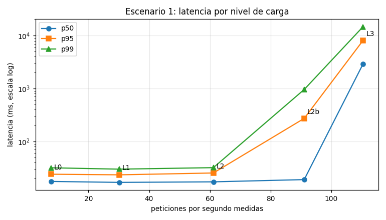
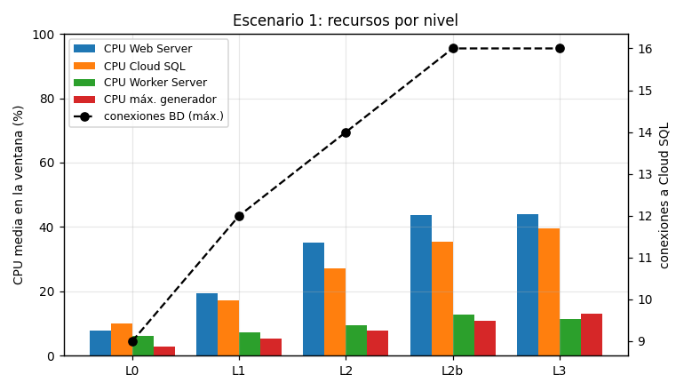
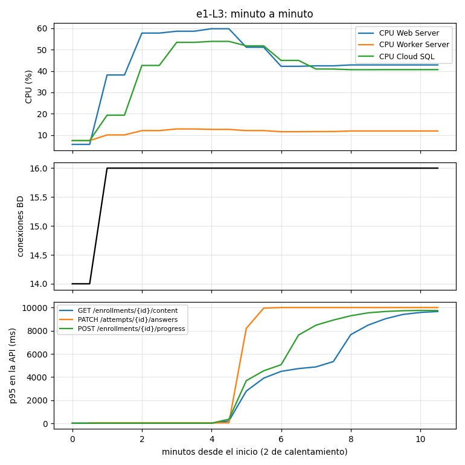
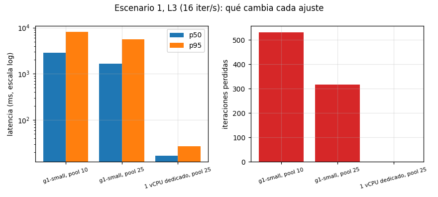
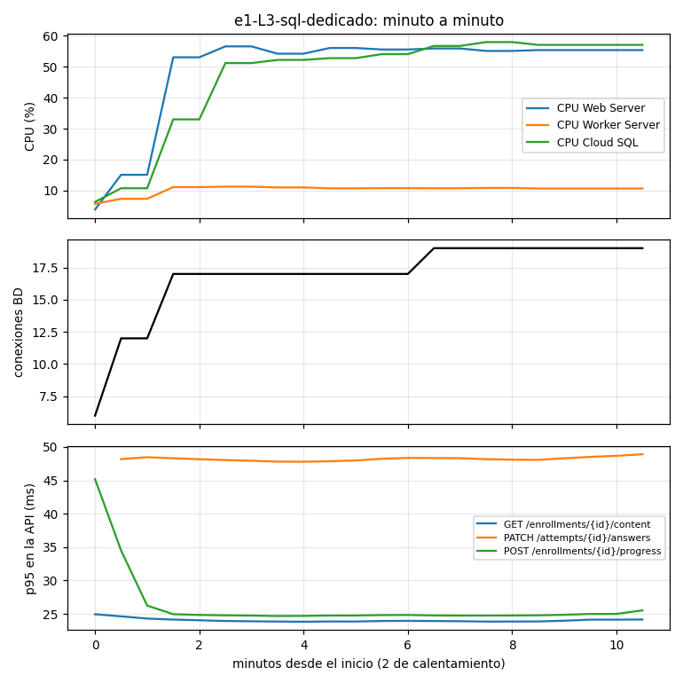
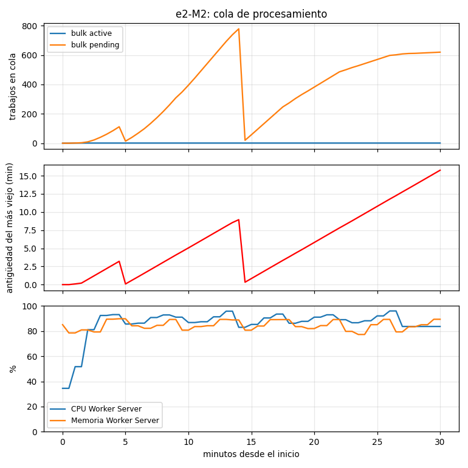
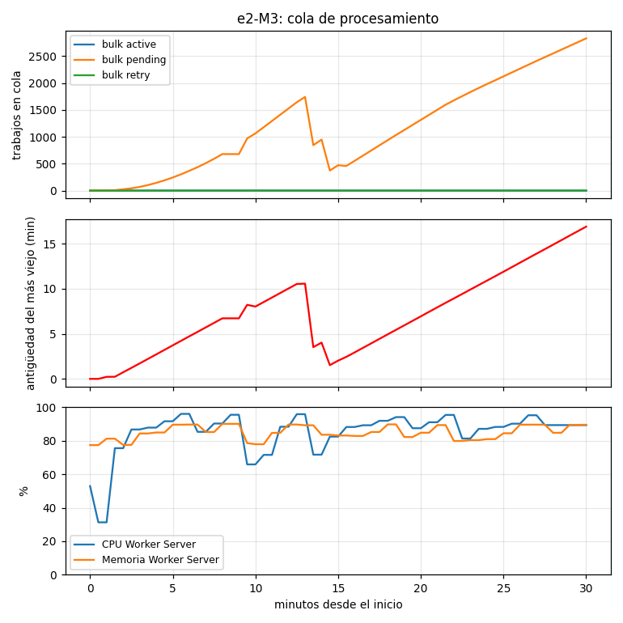

# Pruebas de carga. Entrega 2

Informe de capacidad de la plataforma MOOC desplegada en Google Cloud.
Corridas del 27 y 28 de septiembre de 2026. Los resultados originales, los
guiones y las gráficas están en este directorio (sección 10).

## 1. Conclusiones

| Escenario | Capacidad sostenible | Primer cuello de botella | Segundo |
| --- | --- | --- | --- |
| 1. Sesión de estudio | 61 a 68 peticiones por segundo, unos 240 estudiantes activos, p95 de 24-25 ms durante 15 minutos | Cloud SQL `db-g1-small` | Pool de conexiones de la API |
| 2. Carga y procesamiento de video | Entre 3 y 6 cargas por minuto con la mezcla A/B/C | FFmpeg con un solo `worker-media` | Ninguno medido |

En ningún nivel hubo errores `5xx` ni cargas perdidas. Lo que se degrada es la
latencia, no la corrección.

### 1.1 Escenario 1. La base de datos

**Qué limita.** Cloud SQL `db-g1-small`. Es de núcleo compartido: sostiene una
ráfaga de CPU y, al agotarla, baja a su cuota.

**Por qué es la base y no otro componente:**

- **Todas las operaciones se degradan a la vez.** En L2b el p95 pasa de 25 a
  272 ms y en L3 a 8 s, en las nueve operaciones. Comparten un recurso
  ([6.2](#62-por-operación)).
- **La base se frena sola con la carga intacta.** En L3, al minuto 4,5, su CPU
  cae de 0,54 a 0,41 núcleos. En ese mismo minuto la del Web Server baja del 60
  al 43 %: la API espera a la base, no calcula ([6.4](#64-cuello-de-botella)).
- **Cambiar solo la base lo resuelve.** A la tasa de L3, un vCPU dedicado
  (`db-custom-1-3840`) baja el p95 de 5,6 s a 27 ms, sin iteraciones perdidas.
  Ampliar el pool de la API de 10 a 25 conexiones solo lo baja de 8,1 a 5,6 s:
  es el segundo límite, no el primero.
- **El resto tiene margen.** El Web Server promedia el 44 % de CPU en L3.
  Redis responde en 0,68 ms de media y el Worker Server no pasa del 13 %. El
  generador no pasó del 42 %.

**La integridad se conserva bajo carga.** Las 244 comprobaciones de
concurrencia pasaron: ningún envío duplicado dio dos calificaciones, la clave
del quiz no salió y el porcentaje enviado por el cliente se rechazó
([6.3](#63-integridad-bajo-concurrencia)).

**Límite aparte: la ráfaga de inicios de sesión.** Cada inicio reserva 64 MiB
para argon2id. La API atiende unos 1,5 por segundo; con unos 2 por segundo el
Web Server se queda sin memoria y deja de responder
([6.5](#65-ráfaga-de-inicios-de-sesión)).

### 1.2 Escenario 2. El procesamiento de video

**Qué limita.** FFmpeg, con un solo `worker-media` de concurrencia 1.

**Por qué es FFmpeg y no otro componente:**

- **La demanda supera lo que hay.** La mezcla de M2 pide unos 272 s de
  transcodificación por minuto. Un worker dispone de 60. La de M1 pide 40 y
  cumple ([8.3](#83-cuello-de-botella)).
- **El ritmo no crece con la carga.** M2 y M3 procesan lo mismo, 1,3
  transcodificaciones por minuto, aunque M3 ofrece el doble. La CPU del Worker
  Server se queda en el 86-96 % ([8.2](#82-procesamiento)).
- **El atraso se acumula en la cola, no en los errores.** Con 6 cargas por
  minuto el video tarda de 9 a 14 minutos en estar listo; con 3, segundos. No
  hubo trabajos muertos y la única transcodificación fallida se reintentó con
  éxito.
- **El resto tiene margen.** La carga va directa a Cloud Storage a
  14-20 MiB/s, sin pasar por la API. El Web Server no pasa del 5 % de CPU. La
  reproducción sirvió 16.759 segmentos sin un fallo
  ([8.1](#81-control-transferencia-y-reproducción)).

**Objetivo incumplido sin relación con la carga.** Autorizar una carga tarda
204 ms en p95 desde M0, frente a 150 ms. Cada firma es una llamada a IAM
`signBlob`.

### 1.3 Qué cambiar

| Cambio | Medición que lo respalda |
| --- | --- |
| Cloud SQL con vCPU dedicado | Con la carga de L3, p95 de 5,6 s a 27 ms y 0 iteraciones perdidas |
| Varios `worker-media` que escalen con el tiempo de espera de la cola | 272 s de FFmpeg pedidos por minuto frente a 60, CPU al 86-96 % |
| Reaper que no republique trabajos todavía en cola | 2.554 duplicados descartados en M2 y M3 |
| Redis local a la API para sesiones y límites | 3,5 ms por petición. No limita hoy. Es la hipótesis siguiente cuando la base deje de serlo |

El resto del informe da las condiciones, las definiciones y los datos que
respaldan estas conclusiones.

## 2. Condiciones fijas

| Elemento | Valor |
| --- | --- |
| Región y zona | `us-central1`, `us-central1-a` |
| Web Server | `e2-highcpu-2` (2 vCPU no compartidas, 2 GiB), 30 GiB `pd-balanced`. Caddy 2.10, API y Swagger |
| Worker Server | `e2-highcpu-2`, 30 GiB `pd-balanced`. Redis 7.4, `worker`, `worker-media`, ClamAV 1.4 y Mailpit |
| Base de datos | Cloud SQL PostgreSQL 17, `db-g1-small` (núcleo compartido, 1,7 GiB), 10 GiB SSD, zonal |
| Objetos | Cloud Storage, cuatro buckets en `US-CENTRAL1` |
| Versión de la aplicación | Imágenes `ef646a192a82` |
| Concurrencia de workers | `worker` 20 en `critical=6,default=3`. `worker-media` 1 en `bulk=1` |
| Pool de conexiones | `DB_MAX_CONNS=10` por proceso. La API pasó a 25 tras la sección 6.4 y así se midió el escenario 2 |
| Caché | Redis, base 2, sin cambios respecto a la Entrega 1 |
| Límites de tasa | Los tres límites por IP multiplicados por 100 (`RATE_LIMIT_IP_FACTOR`). Los límites por cuenta y por sesión, sin cambios |
| Generador | `mooc-generador`, `e2-standard-4` (4 vCPU, 16 GiB), `us-central1-a`, IP externa propia |

Los límites por IP se multiplicaron porque el generador es una sola IP. Sin
ese ajuste, `login_ip` (60 por minuto) habría medido el limitador.

**El generador no limitó ninguna corrida válida.** Su CPU máxima fue del 42 %
y no hubo errores de red de su lado. La primera corrida salía por Cloud NAT y
perdió 813 conexiones por agotamiento de puertos. Se descartó y el generador
pasó a tener IP externa.

## 3. Herramienta

k6 2.3.0, en contenedor. Modela cada recorrido como un guion en JavaScript,
valida el cuerpo de cada respuesta con `check()` y exporta un resumen JSON por
corrida.

Los dos escenarios usan tasa de llegada fija (`constant-arrival-rate`). La
carga ofrecida no baja cuando el servidor se pone lento, y la saturación se ve.
Una corrida vale solo si `dropped_iterations` es 0 o la pérdida se explica.

## 4. Datos sintéticos

| Dato | Cantidad | Cómo se crea |
| --- | --- | --- |
| Estudiantes | 600 | En la base, con `make semilla-nube CARGA=1` |
| Profesores | 10 | Igual |
| Cursos publicados | 20 | Por la API, con `k6/preparar.js` |
| Recursos por curso | 63: 60 lecturas y 3 quizzes de 10 preguntas | Igual |
| Inscripciones previas | 510, el 85 % de los estudiantes | Igual |
| Intentos previos | 200, enviados | Igual |
| Sesiones | 600, abiertas antes de medir | Igual. El inicio de sesión no está en el recorrido medido |

| Perfil de video | Duración | Resolución | Tamaño | Rendiciones esperadas | Segmentos de 6 s |
| --- | --- | --- | --- | --- | --- |
| A | 20 s | 640×360 | 1,4 MiB | 360p | 4 |
| B | 1 min | 1280×720 | 8,3 MiB | 360p y 720p | 10 |
| C | 2 min | 1920×1080 | 36 MiB | 360p, 720p y 1080p | 20 |

Los videos se generan con `medios/generar.sh` y el FFmpeg de `worker-media`.
Son imagen de prueba en movimiento y un tono de 440 Hz en H.264 y AAC. La
resolución del original nunca se aumenta.

## 5. Escenario 1. Definición

Cada iteración es una sesión de estudio de un estudiante con cuenta propia.
La cuenta se elige con una permutación del número de iteración, así que dos
iteraciones simultáneas no comparten cuenta.

| # | Operación | Endpoint | Veces por iteración |
| --- | --- | --- | --- |
| 1 | Catálogo | `GET /catalog/courses` | 1 |
| 2 | Ficha del curso | `GET /catalog/courses/{slug}` | 1 |
| 3 | Inscripción | `POST /enrollments` | 0,15 |
| 4 | Contenido | `GET /enrollments/{id}/content` | 1 |
| 5 | Evidencias de progreso | `POST /enrollments/{id}/progress` | 5 (2 aperturas y 3 latidos) |
| 6 | Progreso calculado | `GET /enrollments/{id}/progress` | 1 |
| 7 | Quiz | `POST …/attempts`, `PATCH /attempts/{id}/answers`, `POST /attempts/{id}/submit` | 0,3 |

Son unas 11 peticiones por iteración, 70 % lecturas y 30 % escrituras. Entre
acciones hay pausas de 1 a 3 s. Los latidos respetan la cadencia mínima de 10 s
por recurso, así que una iteración dura unos 30 s. Cada respuesta se valida:
la inscripción tiene `id`, el progreso vuelve `accepted: true`, el intento
tiene nota.

| Nivel | Iteraciones/s | Calentamiento | Medición | Pausa previa |
| --- | --- | --- | --- | --- |
| L0 | 1 | 2 min | 8 min | 3 min |
| L1 | 4 | 2 min | 8 min | 3 min |
| L2 | 8 | 2 min | 8 min, y una repetición de 15 min | 3 min |
| L2b | 12 | 2 min | 8 min | 3 min |
| L3 | 16 | 2 min | 8 min | 3 min |

L2b no estaba en el plan inicial. Se añadió para acotar el punto de
degradación entre L2 y L3.

**Criterio de éxito de un nivel.** p95 de cada operación dentro del objetivo de
su clase (`arquitectura/disenos/objetivos-de-servicio.md`), `5xx` por debajo
del 0,5 %, *timeouts* por debajo del 0,1 %, ninguna máquina con CPU al 100 %
sostenido y todas las comprobaciones funcionales correctas.

| Clase | Objetivo p95 | Operaciones del recorrido |
| --- | --- | --- |
| Lectura cacheable | 150 ms | Catálogo y ficha |
| Lectura autenticada | 250 ms | Contenido y progreso calculado |
| Escritura simple | 400 ms | Guardado de respuestas |
| Escritura compleja | 800 ms | Inscripción, inicio y envío de intento |
| Ingesta de evidencias | 200 ms | `POST /progress` |

**Saturación.** p95 por encima de 3 veces el objetivo, `5xx` por encima del 1 %
o rendimiento que deja de crecer con la tasa ofrecida.

**Parada.** No se sube de nivel después de uno saturado.

**Integridad bajo concurrencia.** Durante L2 corre en paralelo un segundo
recorrido, 6 veces por minuto, con cinco comprobaciones: envío simultáneo del
mismo intento, reenvío con la misma `Idempotency-Key`, envío del intento de
otro estudiante, clave del quiz en el snapshot y porcentaje de progreso enviado
por el cliente.

**Variante separada.** Ráfaga de inicios de sesión de 1 a 20 por segundo en
3 minutos (`ramping-arrival-rate`). Se detiene si el p95 del login pasa de 5 s.

## 6. Escenario 1. Resultados

### 6.1 Por nivel

Fase de medición, sin calentamiento.

| Nivel | Req/s | p50 / p95 / p99 (ms) | Errores 5xx y *timeouts* | Iteraciones perdidas | Comprobaciones |
| --- | --- | --- | --- | --- | --- |
| L0 | 7,7 | 18 / 24 / 32 | 0 | 0 | 100,00 % |
| L1 | 30,2 | 17 / 23 / 30 | 0 | 0 | 100,00 % |
| L2 | 61,2 | 17 / 25 / 32 | 0 | 0 | 100,00 % |
| L2, repetición de 15 min | 68,3 | 17 / 24 / 31 | 0 | 0 | 99,84 % |
| L2b | 91,1 | 19 / 272 / 959 | 0 | 0 | 99,83 % |
| L3 | 110,4 | 2893 / 8067 / 14695 | 0 | 531 | 100,00 % |

| Nivel | CPU web / worker / SQL | Memoria web / worker | Red del Web Server, entrada / salida | Conexiones BD máx. | Comandos Redis/s |
| --- | --- | --- | --- | --- | --- |
| L0 | 8 / 6 / 10 % | 35 / 74 % | 0,17 / 0,09 MB/s | 9 | 54 |
| L1 | 19 / 7 / 17 % | 38 / 74 % | 0,69 / 0,34 MB/s | 12 | 160 |
| L2 | 35 / 9 / 27 % | 44 / 74 % | 1,62 / 0,69 MB/s | 14 | 361 |
| L2, repetición | 36 / 10 / 29 % | 53 / 75 % | 2,74 / 0,69 MB/s | 16 | 412 |
| L2b | 44 / 13 / 35 % | 55 / 75 % | 2,50 / 1,05 MB/s | 16 | 537 |
| L3 | 44 / 11 / 40 % | 55 / 74 % | 3,03 / 1,37 MB/s | 16 | 629 |

CPU media en la ventana. El disco de las dos máquinas no pasó del 16 % en
ninguna corrida. Ningún nivel devolvió `429`.





**Variación.** L2 y su repetición de 15 minutos dan el mismo p95 (25 y 24 ms)
con 7 % más de tráfico. El nivel es estable.

**Rechazos que no son fallos.** Las comprobaciones que fallan en la repetición
de L2 y en L2b son 113 y 96 respuestas `409` al iniciar un intento. La cuenta
tenía otro intento abierto en ese quiz, que quedó así cuando L3 cortó
iteraciones a mitad (105 en la base). La regla que lo rechaza es el índice
`attempts_one_in_progress`. El guion cuenta ahora ese `409` como rechazo de
negocio.

### 6.2 Por operación

p95 en milisegundos. En negrita, lo que supera el objetivo de su clase.

| Operación | Objetivo | L2 | L2b | L3 |
| --- | --- | --- | --- | --- |
| `GET /catalog/courses` | 150 | 7 | 125 | **1635** |
| `GET /catalog/courses/{slug}` | 150 | 7 | **161** | **3154** |
| `GET /enrollments/{id}/content` | 250 | 20 | 241 | **6089** |
| `GET /enrollments/{id}/progress` | 250 | 14 | 236 | **6196** |
| `POST /enrollments/{id}/progress` | 200 | 25 | **359** | **7699** |
| `PATCH /attempts/{id}/answers` | 400 | 36 | **782** | **20491** |
| `POST /enrollments` | 800 | 20 | 311 | **6315** |
| `POST …/attempts` | 800 | 21 | 423 | **10551** |
| `POST /attempts/{id}/submit` | 800 | 24 | 364 | **10828** |

L2 cumple todos los objetivos. L2b incumple tres, y L3 supera 3 veces el
objetivo en todas las operaciones. Todas se degradan a la vez, así que
comparten un recurso. Las escrituras de varias filas se degradan primero y
más: `PATCH /answers` escribe 10 respuestas por llamada.

### 6.3 Integridad bajo concurrencia

Durante L2.

| Comprobación | Correctas | Fallidas |
| --- | --- | --- |
| Dos envíos simultáneos del mismo intento, una sola calificación | 49 | 0 |
| Reenvío con la misma `Idempotency-Key`, la misma respuesta | 49 | 0 |
| Envío del intento de otro estudiante, rechazado | 48 | 0 |
| La clave del quiz no aparece en el snapshot | 49 | 0 |
| Porcentaje enviado por el cliente, rechazado | 49 | 0 |

### 6.4 Cuello de botella

En L3 la latencia sube al minuto 4,5. En ese mismo minuto la CPU del Web
Server baja del 60 al 43 % y la de Cloud SQL del 54 al 41 %. Las conexiones a
la base se quedan fijas en 16.



La CPU consumida por la base
(`rate(cloudsql_googleapis_com:database_cpu_usage_time[1m])`) llega a 0,54
núcleos y cae a 0,41-0,44 con la carga ofrecida intacta. Es la cuota sostenida
del núcleo compartido de `db-g1-small` al agotar su ráfaga.

Se midió cambiando una sola cosa en cada corrida, a la misma tasa de L3:

| Configuración | Req/s | p50 / p95 (ms) | Iteraciones perdidas | Conexiones BD |
| --- | --- | --- | --- | --- |
| `db-g1-small`, pool de la API 10 | 110,4 | 2893 / 8067 | 531 | 16 |
| `db-g1-small`, pool de la API 25 | 114,3 | 1654 / 5594 | 317 | 32 |
| `db-custom-1-3840` (1 vCPU dedicado), pool 25 | 121,2 | 17 / 27 | 0 | 19 |





**El primer límite es Cloud SQL `db-g1-small`.** El pool de la API es el
segundo: ampliarlo baja el p95 un 30 %. Tras la prueba la base volvió a
`db-g1-small`.

Redis no limita. Bajo L2, la ida y vuelta desde el Web Server mide 0,68 ms de
media y 3 ms de máximo (`redis-cli --latency`, 2.774 muestras). Cada petición
hace unos 5,2 comandos, unos 3,5 ms, y el Worker Server no pasa del 13 % de CPU.

### 6.5 Ráfaga de inicios de sesión

| Hora (UTC) | Demanda ofrecida | Inicios atendidos | Memoria del Web Server |
| --- | --- | --- | --- |
| 23:14:30 | 1 por segundo | 0 | 50 % |
| 23:15:00 | ~4 por segundo | ~0,5 por segundo | 59 % |
| 23:15:30 | ~7 por segundo | ~1,5 por segundo | 59 %, último dato |
| 23:16:33 | ~14 por segundo | 0, *timeouts* de 60 s | Sin datos |

Cada inicio de sesión reserva 64 MiB para argon2id. La API atiende unos 1,5
por segundo. Por encima se acumulan y el Web Server, con 2 GiB y sin swap, se
queda sin memoria y deja de responder. Se recuperó reiniciando la máquina. El
criterio de parada por p95 actuó tarde porque k6 no vigila la memoria.

## 7. Escenario 2. Definición

**Cargas.** Por iteración, un profesor de los 10 sube un video:

1. `POST /assets/init` autoriza la carga y firma una URL por parte de 8 MiB.
2. `PUT` de cada parte directo a Cloud Storage, 4 en paralelo.
3. `POST /assets/{id}/complete` une las partes y responde `202`.
4. `GET /assets/{id}` cada 5 s, hasta un estado terminal o 20 minutos.

**Consumo.** Cada espectador abre una sesión de reproducción
(`POST /enrollments/{id}/media-sessions`), pide el manifiesto maestro y el
playlist de la variante más baja, y descarga hasta 20 segmentos, cada uno
cuando termina el anterior. Es la cadencia de reproducción, no una descarga
masiva.

| Nivel | Cargas/min | Mezcla A/B/C | Espectadores | Duración |
| --- | --- | --- | --- | --- |
| M0 | 1 | 1/0/0 | 5 | 10 min |
| M1 | 3 | 2/1/0 | 20 | 10 min |
| M2 | 6 | 3/2/1 | 45 | 10 min |
| M3 | 12 | 6/4/2 | 90 | 10 min |

Entre niveles se espera a que la cola `bulk` quede vacía. La concurrencia de
los workers es la misma en todos los niveles.

**Criterios.** Éxito si la cola drena al terminar el nivel, no hay trabajos
muertos y el video está listo en menos de 3 veces su duración. Saturación si la
cola crece de forma monótona durante 5 minutos. Parada del drenaje final por
ese mismo criterio.

## 8. Escenario 2. Resultados

### 8.1 Control, transferencia y reproducción

| Nivel | p95 autorizar / confirmar (ms) | Transferencia (MiB/s) | p95 por parte de 8 MiB (ms) | p95 manifiesto / playlist / segmento (ms) | Segmentos fallidos |
| --- | --- | --- | --- | --- | --- |
| M0 | 204 / 316 | 14,3 | 100 | 7 / 1284 / 111 | 0 de 526 |
| M1 | 256 / 543 | 16,9 | 199 | 7 / 1045 / 78 | 0 de 2.093 |
| M2 | 308 / 562 | 20,5 | 237 | 13 / 864 / 78 | 0 de 4.689 |
| M3 | 388 / 569 | 16,9 | 292 | 44 / 823 / 80 | 0 de 9.451 |

La transferencia no pasa por la API. La CPU del Web Server no pasó del 5 %, y
su red de 0,06 MB/s, en ningún nivel.

**Autorizar no cumple su objetivo de 150 ms ni en M0**, con 204 ms. Cada firma
es una llamada a IAM `signBlob` de unos 200 ms. Confirmar supera su objetivo de
300 ms porque une las partes con `compose`. El playlist cuesta de 0,8 a
1,3 s porque firma cada segmento. Ninguno empeora con la carga.

### 8.2 Procesamiento

| Nivel | Cargas lanzadas / en `ready` al terminar el sondeo | Transcodificaciones/min | De la confirmación a `ready`, mediana A / B / C | Cola `bulk` máx. | Antigüedad máx. |
| --- | --- | --- | --- | --- | --- |
| M0 | 11 / 11 | 1,0 | 5 s / - / - | 0 | 0 |
| M1 | 31 / 31 | 2,8 | 10 s / 35 s / - | 0 | 0 |
| M2 | 43 / 41 | 1,3 | 9,4 / 9,6 / 11,3 min | 779 | 16 min |
| M3 | 71 / 33 | 1,3 | 11,9 / 12,7 / 14,1 min | 2.831 | 17 min |

| Nivel | CPU Worker Server, media / máx. | Memoria Worker Server máx. | Red del Worker Server, entrada / salida | Disco máx. | Reintentos / muertos |
| --- | --- | --- | --- | --- | --- |
| M0 | 16 / 70 % | 89 % | 0,09 / 0,90 MB/s | 15 % | 0 / 0 |
| M1 | 51 / 60 % | 85 % | 0,62 / 0,59 MB/s | 14 % | 0 / 0 |
| M2 | 86 / 96 % | 90 % | 2,89 / 1,49 MB/s | 15 % | 0 / 0 |
| M3 | 85 / 96 % | 90 % | 4,67 / 1,25 MB/s | 15 % | 1 / 0 |





Duración de cada transcodificación, medida en la base
(`resultados/estado-de-la-base-tras-las-corridas.txt`):

| Perfil | Transcodificaciones | Duración media | Espera en cola en M2 |
| --- | --- | --- | --- |
| A | 85 | 3,3 s | ~9,3 min |
| B | 45 | 33 s | ~9,0 min |
| C | 16 | 196 s | ~8,0 min |

La espera en cola es la mediana de la confirmación a `ready` menos la duración
media del procesamiento.

**Drenaje.** El drenaje final de M3 se cortó a los 6 minutos porque la cola
crecía de forma monótona. Media hora después, 58 de las 71 cargas de M3
estaban en `ready`, 12 en `clean` (verificadas, esperando FFmpeg) y 1 en
`processing`. Ninguna en un estado de fallo. En toda la campaña terminaron bien
163 verificaciones, 163 escaneos y 148 transcodificaciones. La única
transcodificación fallida, en M3, se reintentó con éxito.

**La profundidad de la cola exagera el atraso.** El reaper republica los
trabajos que llevan tiempo en `queued` aunque sigan esperando en Redis. La
idempotencia descartó 856 duplicados en M2 y 1.698 en M3, y ningún video se
transcodificó dos veces. Por eso la cola cae de golpe cuando el worker queda
libre. El atraso real lo mide el tiempo hasta `ready`.

### 8.3 Cuello de botella

**El límite es FFmpeg con un solo `worker-media`.** La mezcla de M1 pide unos
40 s de transcodificación por minuto (2 A y 1 B). La de M2 pide unos 272 s
(3 A, 2 B y 1 C), 4,5 veces los 60 s por minuto de un worker con concurrencia
1. La CPU del Worker Server pasa del 51 al 86 % y el ritmo se queda en unas 1,3
transcodificaciones por minuto. La memoria se sostiene en el 90 % y el disco no
interviene.

**La capacidad sostenible está entre 3 y 6 cargas por minuto** con esta mezcla.
M1 cumple el objetivo de video listo en menos de 3 veces su duración. M2 no lo
cumple: el perfil C tarda 11,3 minutos para un video de 2.

| Cambio | Efecto esperado según lo medido |
| --- | --- |
| Más capacidad de procesamiento | Es el cambio que sube la capacidad. Con la mezcla de M2 hacen falta unos 5 `worker-media` en máquinas separadas. Un segundo FFmpeg en la misma máquina no ayuda, con la CPU al 86-96 % |
| Una CDN | No cambia el límite. Quita a la API la firma por segmento del playlist (0,8 a 1,3 s) con una cookie firmada por sesión, y descarga Cloud Storage |
| Más concurrencia de transferencias | No cambia el límite. La carga directa corre a 14-20 MiB/s y nunca limitó. Subir más rápido solo llena antes la cola |

## 9. Limitaciones

- `db-g1-small` es de núcleo compartido y sin SLA. Parte de la variación puede
  venir de ahí.
- En M3, k6 lanzó 71 de las 120 cargas previstas. Cada carga retiene su usuario
  virtual hasta 20 minutos mientras sondea, y el grupo no sostuvo la tasa. El
  máximo probado es 71 cargas en 10 minutos.
- La ráfaga de inicios de sesión no vigiló la memoria y congeló el Web Server.
- Los videos son sintéticos. No se midió tiempo hasta el primer cuadro ni
  cortes de reproducción, porque haría falta un reproductor.
- Las métricas de la aplicación se leen cada 30 s. Picos de menos duración
  pueden no verse.

## 10. Reproducir estas pruebas

| Qué | Dónde |
| --- | --- |
| Guiones de k6 | [`k6/`](k6/): `preparar.js`, `escenario1.js`, `rafaga-login.js`, `preparar-medios.js`, `escenario2.js`, `comun.js` y `medios.js` |
| Videos | [`medios/generar.sh`](medios/generar.sh) |
| Resultados originales | [`resultados/`](resultados/): el resumen de k6 (`<corrida>.json`) y las métricas de Cloud Monitoring de la misma ventana (`<corrida>-metricas.json`) |
| Estado de la base tras las corridas | [`resultados/estado-de-la-base-tras-las-corridas.txt`](resultados/estado-de-la-base-tras-las-corridas.txt) |
| Tablas y gráficas | [`metricas/tabla.py`](metricas/tabla.py) y [`metricas/graficas.py`](metricas/graficas.py), que leen `resultados/` |
| Exportación de métricas | [`metricas/exportar.py`](metricas/exportar.py), PromQL contra Cloud Monitoring |

```bash
make semilla-nube CARGA=1
make carga-sincronizar && make carga-medios
make carga K6=preparar.js ETIQUETA=preparar
make carga-nivel K6=escenario1.js ETIQUETA=e1-L2 ARGS="-e TASA=8 -e INTEGRIDAD=1"
make carga-nivel K6=rafaga-login.js ETIQUETA=e1-rafaga-login ARGS="-e HASTA=20"
make carga K6=preparar-medios.js ETIQUETA=preparar-medios
make carga-nivel K6=escenario2.js ETIQUETA=e2-M2 \
  ARGS="-e CARGAS=6 -e MEZCLA=3/2/1 -e ESPECTADORES=45 -e DURACION=10m -e ESPERA_MAX=20"
make carga-tabla ARGS="e1 e1-L0 e1-L1 e1-L2"
make carga-graficas ARGS="e1 e1-L0 e1-L1 e1-L2 e1-L2b e1-L3"
```
