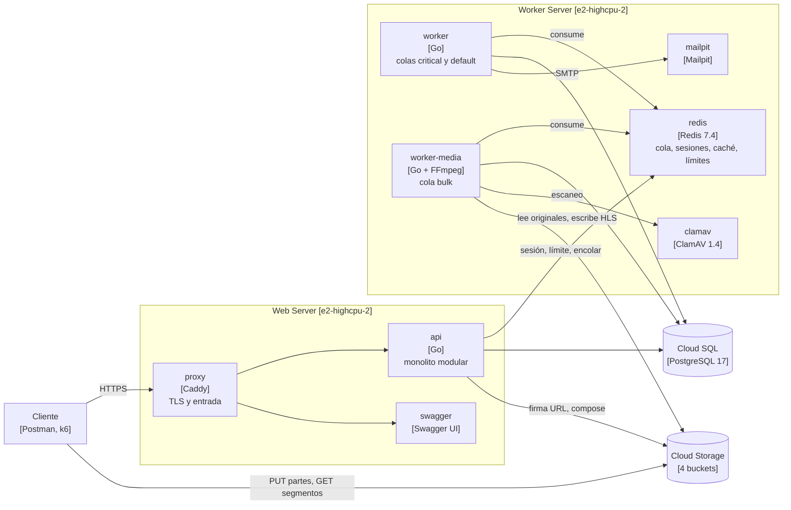
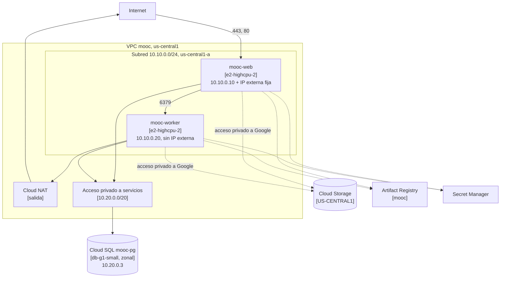

# Informe de arquitectura. Entrega 2

Santiago Chica Castano, Josue Briceño Urquijo, Daniel Alfredo Reales Paba y
Michael Javier Patiño Pantoja.

Plataforma MOOC desplegada en Google Cloud sobre dos máquinas virtuales, con la
base en Cloud SQL y los archivos en Cloud Storage. URL pública
`https://35-184-146-250.sslip.io`.

## Qué cambió desde la Entrega 1

La aplicación es la misma. Cambia dónde corre. La API, los workers y Redis
pasan de un Compose local a dos máquinas de Compute Engine. PostgreSQL pasa a
Cloud SQL y MinIO a Cloud Storage. El código nuevo es el que el despliegue y la
medición exigen: un adaptador nativo de Cloud Storage, métricas de la cola,
límites por IP configurables y la configuración que separa local de nube. La
colección de Postman de la Entrega 1 pasa entera contra la URL pública.

## 1. Introducción y objetivos

El objetivo es un primer despliegue en la nube pública, con capacidad fija, que
conserve las reglas de negocio y permita medir dónde se degrada.

### Alcance de esta entrega

| Área | Qué se entrega |
| --- | --- |
| Cómputo | Web Server y Worker Server en Compute Engine, con Docker Compose |
| Datos | PostgreSQL 17 en Cloud SQL, zonal y con IP privada |
| Objetos | Cuatro buckets de Cloud Storage con carga directa y URL firmadas |
| Red | VPC propia, firewall por cuenta de servicio, Cloud NAT e IAP |
| Infraestructura | Todo en Terraform, con el estado en un bucket versionado |
| Capacidad | Dos escenarios medidos con k6, en `capacity-planning/` |

### Contenido del documento

| Contenido | Sección |
| --- | --- |
| Modelo de componentes | 5 y 6 |
| Modelo de despliegue | 7 |
| Decisiones y adaptaciones | 9 |
| Operación y recuperación | 8 |
| Capacidad, costo y limitaciones | 10 y 11 |

## 2. Restricciones

| Restricción | Consecuencia |
| --- | --- |
| Dos máquinas de 2 vCPU, 2 GiB y 30 GiB | `e2-highcpu-2`, la combinación exacta del catálogo |
| Sin CDN, balanceador, autoescalado ni alta disponibilidad | TLS termina en Caddy y el HLS sale directo de Cloud Storage |
| Sin caché ni mensajería administradas | Redis en contenedor en el Worker Server |
| Base administrada zonal, sin réplicas | Cloud SQL `ZONAL` con copias diarias |
| Conexión privada a la base | Cloud SQL sin IP pública, por acceso privado a servicios |
| Ningún secreto en el repositorio ni en las imágenes | Secret Manager, leído por cada máquina al arrancar |
| Ninguna clave JSON de cuenta de servicio | Identidad de la instancia y ADC de usuario (ADR-0015, D3) |

## 3. Contexto y alcance

Los usuarios llegan por HTTPS al Web Server. Los archivos no pasan por la API.
El cliente los sube a Cloud Storage con URL firmadas por parte y los descarga
de la misma forma. El correo de la entrega lo recibe un Mailpit en el Worker
Server, sin salida a Internet, porque no hay proveedor de correo contratado.

## 4. Estrategia de solución

Se reutiliza lo que ya funcionaba. Cada máquina corre el mismo `docker compose`
de local, recortado a sus servicios y con las imágenes del registro. Lo que
cambia entre local y nube son variables de entorno y un adaptador de objetos
elegido con `OBJECT_STORE`. Terraform crea todo salvo el bucket de su propio
estado. El detalle de la ejecución está en `arquitectura/despliegue-gcp.md`.

## 5. Vista de bloques

La API atiende todo el tráfico síncrono. Consulta Redis en cada petición
autenticada para la sesión y el límite de tasa, y encola ahí los trabajos
después de confirmarlos en PostgreSQL. El `worker` consume correo e insignias.
El `worker-media` consume la cola `bulk`, que verifica, escanea y transcodifica.
El cliente habla directamente con Cloud Storage para los bytes. La API solo
autoriza, firma y confirma.

## 6. Vista de ejecución

La carga de un video sigue siete pasos.

1. La API crea el asset y devuelve una URL firmada por parte de 8 MiB.
2. El cliente sube cada parte a `tmp/{uploadID}/` en el bucket de originales.
3. Al completar, la API une las partes con `compose`, en niveles de 32.
4. La API responde 202 y encola la verificación, sin esperar al worker.
5. El worker recalcula el SHA-256 leyendo de Cloud Storage y lo compara con el
   declarado.
6. ClamAV escanea el original. Lo infectado va a cuarentena y no llega a FFmpeg.
7. FFmpeg genera las variantes HLS en el bucket de derivados y el asset pasa a
   `ready`.

La reproducción abre una sesión por inscripción. El manifiesto maestro sale de
la API y cada segmento es una URL firmada hacia Cloud Storage.

## 7. Vista de despliegue

| Recurso | Configuración |
| --- | --- |
| Región y zona | `us-central1`, `us-central1-a` para las máquinas y la base |
| Máquinas | `e2-highcpu-2`, Debian 12, disco `pd-balanced` de 30 GiB |
| Contenedores del Web Server | `proxy`, `api`, `swagger` y `migrate` al arrancar |
| Contenedores del Worker Server | `redis`, `worker`, `worker-media`, `clamav`, `mailpit` |
| Volúmenes | Certificados de Caddy y datos de Redis con AOF |
| Base | PostgreSQL 17, `db-g1-small`, 10 GiB SSD, solo conexiones cifradas |
| Objetos | `originals`, `derived`, `quarantine` privados y `badges` de lectura pública |

### Reglas de acceso

| Regla | Origen | Destino | Puertos |
| --- | --- | --- | --- |
| `mooc-web-publico` | Internet | Cuenta del Web Server | 80, 443 |
| `mooc-redis-interno` | Cuenta del Web Server | Cuenta del Worker Server | 6379 |
| `mooc-ssh-iap` | Rango de IAP | Las dos cuentas | 22 |
| `mooc-denegar-resto` | Internet | Toda la VPC | Todo, con registro |

Las reglas apuntan a cuentas de servicio y no a etiquetas. Cloud SQL no lleva
regla porque está al otro lado del peering y no tiene IP pública. La red
`default` que crea Compute Engine se borró con Terraform.

## 8. Conceptos transversales

### Operación

| Tarea | Cómo |
| --- | --- |
| Aprovisionar | `make tf ENTORNO=entrega2 ARGS=plan`, revisar y aplicar el plan guardado |
| Publicar imágenes | `make publicar`, que etiqueta con el SHA y se niega con cambios sin confirmar |
| Desplegar | Nuevo SHA en `version_imagenes`, `apply` y `google_metadata_script_runner startup` |
| Migrar | El servicio `migrate` corre antes que la API en cada arranque |
| Verificar | `make postman-nube` pasa la colección entera contra la URL pública |
| Administrar | `make ssh MAQUINA=mooc-worker`, por el túnel de IAP con OS Login |
| Reiniciar | Reiniciar la máquina vuelve a ejecutar el arranque y deja todo en pie |
| Pausar la base | `cloudsql_encendida = false` en `terraform.tfvars` |

Cada máquina recibe por metadatos su composición, su configuración y un `.env`
sin secretos. El script `deploy/arranque.sh` instala Docker y el agente de
operaciones, lee los secretos de Secret Manager con la identidad de la máquina,
escribe el `.env` con permisos 0600 y levanta la composición.

### Secretos

`database-url` y `seed-password` los genera Terraform como valores efímeros y
los escribe con atributos de solo escritura. No quedan en el estado ni en el
plan. `smtp-password` existe vacío hasta que haya proveedor. Ninguna imagen ni
archivo del repositorio contiene un secreto, y `scripts/sin-credenciales.sh` lo
comprueba en cada CI. La contraseña de demostración de la Entrega 1 no sirve en
la nube. La semilla la rechaza fuera de desarrollo y el login con ella devuelve
401.

### Respaldo y reconstrucción

Cloud SQL hace una copia diaria y la conserva siete días. Las copias sobreviven
al borrado de la instancia (`retain_backups_on_delete`). La reconstrucción
parte del repositorio y del bucket del estado. Se ejecuta `terraform apply`, se
publican las imágenes, se siembra y se pasa la colección. El tiempo medido está
en la sección 10.

### Seguridad de la sesión

La API autentica con un token opaco en `Authorization`, no con cookies. Sin
cookie de sesión no hay petición que un tercer sitio pueda forjar, por eso no
hay token CSRF. El token se revoca en Redis y todo el tráfico va por HTTPS.

### Observabilidad

El agente de operaciones envía a Cloud Monitoring CPU, memoria, disco y red de
cada máquina. También rasca `/metrics` de la API y de los workers y lee Redis.
Las métricas de la cola son nuevas en esta entrega: profundidad por estado,
antigüedad del trabajo más viejo y tasa de procesamiento.

## 9. Decisiones de arquitectura

| Decisión | Motivo | Registro |
| --- | --- | --- |
| Redis único en el Worker Server | La mensajería va en esa máquina. Medir primero da el número que justificaría partirlo | ADR-0016, D2 |
| Adaptador nativo de Cloud Storage | La interoperabilidad S3 exige claves HMAC de larga vida | ADR-0015, D1 |
| Multipart emulado con `compose` | Cloud Storage no firma partes de una carga multipart | ADR-0015, D1 |
| URL firmadas con `signBlob` | La cuenta firma sin clave descargada, con permiso sobre sí misma | ADR-0015, D3 |
| TLS en Caddy con `sslip.io` | Sin balanceador no hay certificado gestionado | ADR-0016, D4 |
| Cloud SQL `db-g1-small` | Cabe en el presupuesto de 50 USD. Se registra como limitación | `terraform.tfvars` |
| `worker-media` con concurrencia 1 | Con 2 vCPU un segundo FFmpeg solo le quita CPU al primero | `deploy/compose.worker.yml` |

### Diferencias frente a la arquitectura objetivo

| Objetivo | En esta entrega |
| --- | --- |
| API y workers en Cloud Run con autoescalado | Una máquina fija para cada lado |
| Memorystore con réplica | Redis en contenedor, sin réplica |
| Cloud SQL con alta disponibilidad y PITR | Zonal con copia diaria |
| Cloud CDN con cookie firmada | URL firmada directa a Cloud Storage |
| Despliegue desde CI con Workload Identity Federation | Desde una máquina del equipo con ADC de usuario |

El contrato de la API no cambia entre las dos columnas. `media-sessions`
devuelve `signed_url` y el campo `delivery` permitirá pasar a cookie de CDN.

## 10. Requisitos de calidad

### Capacidad medida

La definición, los resultados por nivel y la evidencia están en
`capacity-planning/pruebas_de_carga_entrega2.md`.

El escenario 1 sostiene unas 60 a 70 peticiones por segundo con p95 de 25 ms
durante 15 minutos. A 91 empieza la degradación y a 110 el p95 llega a 8 s.
No hay errores en ningún nivel. Todo lo que responde, responde bien.

El primer límite es Cloud SQL `db-g1-small`. Su núcleo compartido consume
0,54 núcleos y, al agotar la ráfaga, baja a 0,41 aunque la carga siga. Ninguna
máquina pasa del 60 % de CPU. Se comprobó cambiando una cosa cada vez. Ampliar
el pool de la API de 10 a 25 conexiones bajó el p95 de 8,1 a 5,6 s. Un vCPU
dedicado en la base lo bajó a 27 ms con la misma carga. El salto a Redis cuesta
0,68 ms de ida y vuelta y no satura.

La ráfaga de inicios de sesión congela el Web Server a partir de unos dos por
segundo. Cada inicio reserva 64 MiB para argon2id y la máquina tiene 2 GiB sin
swap.

PENDIENTE_RESUMEN_E2

### Costo

Estimación del 27 de septiembre de 2026 con precios de lista de `us-central1`.
Supone las máquinas encendidas solo durante el trabajo y las pruebas, unas 80
horas, y la base encendida dos semanas.

| Recurso | Unidad | Precio de lista | Uso previsto | Costo |
| --- | --- | --- | --- | --- |
| 2 × `e2-highcpu-2` | hora | 0,0495 USD | 160 h | 7,92 USD |
| Generador `e2-standard-4` | hora | 0,134 USD | 12 h | 1,61 USD |
| Discos `pd-balanced` | GiB-mes | 0,10 USD | 90 GiB × 0,5 mes | 4,50 USD |
| Cloud SQL `db-g1-small` | hora | 0,035 USD | 336 h | 11,76 USD |
| IP externa en uso | hora | 0,005 USD | 336 h | 1,68 USD |
| Cloud NAT | hora | 0,0014 USD | 336 h | 0,47 USD |
| Cloud Storage y operaciones | GiB-mes | 0,020 USD | 20 GiB | 0,40 USD |
| Métricas de la aplicación | millón de muestras | 0,06 USD | 40 millones | 2,40 USD |

El total previsto es de unos 31 USD, dentro del presupuesto de 50 USD. El
presupuesto `mooc-entrega2` avisa al 50, 80 y 100 %. Excluye los créditos de la
cuenta educativa, porque con ellos el gasto neto sería cero y ninguna alerta
saltaría. El tráfico de los segmentos no paga salida a Internet en las pruebas
porque el generador llega a Cloud Storage por la red de Google.

PENDIENTE_CONSUMO_OBSERVADO

## 11. Riesgos y deuda técnica

### Puntos únicos de falla

| Componente | Si cae |
| --- | --- |
| Web Server | La plataforma deja de responder |
| Worker Server | Se pierden las sesiones de todos y se detiene el procesamiento. Los trabajos sobreviven en PostgreSQL |
| Cloud SQL zonal | Se detiene todo hasta restaurar la copia |

### Limitaciones

- `db-g1-small` tiene núcleo compartido y no tiene SLA. Puede ralentizarse sin
  aviso.
- ClamAV ocupa 966 MiB residentes. El Worker Server queda con 373 MiB libres en
  reposo y sin swap.
- Cada firma de URL es una llamada a IAM de unos 200 ms, y la API firma las
  partes en serie.
- `/metrics` es público a través de Caddy.
- El correo no sale a Internet.

### Hacia una aplicación elástica

PENDIENTE_EVOLUCION

## 12. Glosario

| Término | Significado |
| --- | --- |
| ADC | Credenciales por defecto de la aplicación de Google |
| IAP | Proxy con identidad de Google para entrar por SSH sin abrir el puerto |
| `compose` | Operación de Cloud Storage que une objetos sin descargarlos |
| `signBlob` | Operación de IAM que firma con la clave de una cuenta de servicio |
| Nivel | Tasa de llegada fija durante una corrida de carga |
