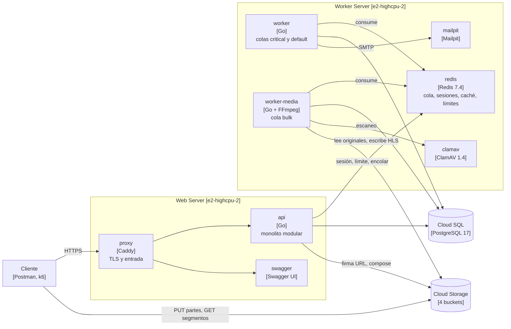
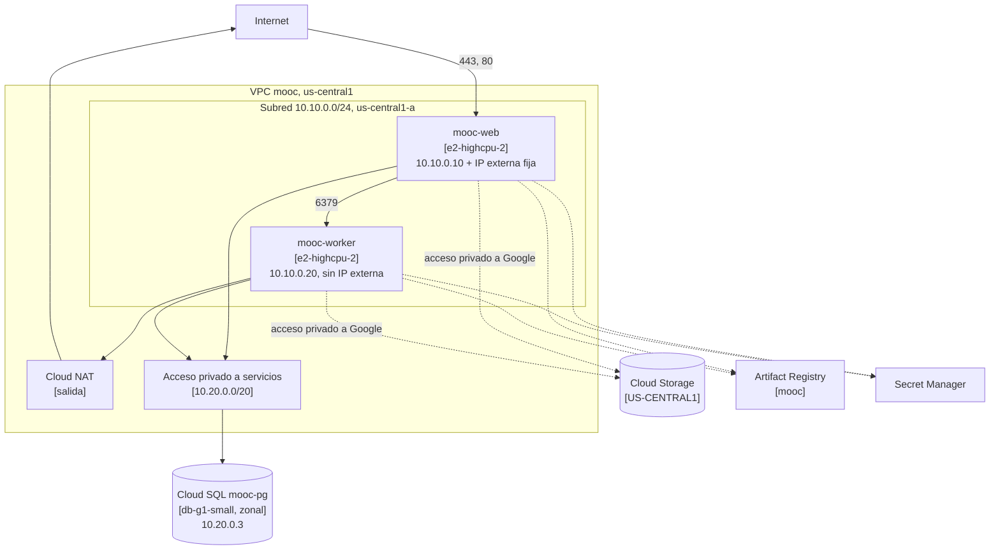

# Informe de arquitectura. Entrega 2

Santiago Chica Castano, Josue Briceño Urquijo, Daniel Alfredo Reales Paba y
Michael Javier Patiño Pantoja.

URL pública `https://35-184-146-250.sslip.io`.

## Qué cambió desde la Entrega 1

La aplicación es la misma y cambia dónde corre. La API, los workers y Redis
pasan a dos máquinas de Compute Engine, PostgreSQL a Cloud SQL y MinIO a Cloud
Storage. El código nuevo es el que exigen el despliegue y la medición, y la
colección de Postman de la Entrega 1 pasa entera en la nube.

## 1. Introducción y objetivos

El objetivo es un primer despliegue en la nube pública, con capacidad fija, que
conserve las reglas de negocio y permita medir dónde se degrada.

### Alcance de esta entrega

| Área | Qué se entrega |
| --- | --- |
| Cómputo | Web Server y Worker Server en Compute Engine, con Docker Compose |
| Datos | PostgreSQL 17 en Cloud SQL, zonal y con IP privada |
| Objetos | Cuatro buckets de Cloud Storage con carga directa y URL firmadas |
| Red | VPC propia, firewall por cuenta de servicio, Cloud NAT e IAP |
| Infraestructura | Todo en Terraform, con el estado en un bucket versionado |
| Capacidad | Dos escenarios medidos con k6, en `capacity-planning/` |

### Contenido del documento

| Contenido | Sección |
| --- | --- |
| Modelo de componentes | 5 y 6 |
| Modelo de despliegue | 7 |
| Decisiones y adaptaciones | 9 |
| Operación y recuperación | 8 |
| Capacidad, costo y limitaciones | 10 y 11 |

## 2. Restricciones

| Restricción | Consecuencia |
| --- | --- |
| Dos máquinas de 2 vCPU, 2 GiB y 30 GiB | `e2-highcpu-2`, la combinación exacta del catálogo |
| Sin CDN, balanceador, autoescalado ni alta disponibilidad | TLS termina en Caddy y el HLS sale directo de Cloud Storage |
| Sin caché ni mensajería administradas | Redis en contenedor en el Worker Server |
| Base administrada zonal, sin réplicas | Cloud SQL `ZONAL` con copias diarias |
| Conexión privada a la base | Cloud SQL sin IP pública, por acceso privado a servicios |
| Ningún secreto en el repositorio ni en las imágenes | Secret Manager, leído por cada máquina al arrancar |

## 3. Contexto y alcance

Los usuarios llegan por HTTPS al Web Server. Los archivos van directamente a
Cloud Storage con URL firmadas. El correo lo recibe un Mailpit en el Worker
Server, sin salida a Internet, porque no hay proveedor contratado.

## 4. Estrategia de solución

Cada máquina corre el `docker compose` de local recortado a sus servicios, con
las imágenes del registro. Entre local y nube cambian variables de entorno y el
adaptador de objetos (`OBJECT_STORE`). Terraform crea todo salvo el bucket de su
propio estado. La ejecución está en `arquitectura/despliegue-gcp.md`.

## 5. Vista de bloques

La API atiende todo el tráfico síncrono. Consulta Redis en cada petición
autenticada para la sesión y el límite de tasa. El cliente habla directamente
con Cloud Storage para los bytes, y la API solo autoriza, firma y confirma.

| Módulo de la API | Responsabilidad |
| --- | --- |
| `identity` y `admin` | Cuentas, sesiones, roles, estados y administración |
| `authoring` | Jerarquía del curso y publicación de versiones inmutables |
| `learning` | Catálogo, inscripción, contenido y progreso calculado en el servidor |
| `assessment` | Quizzes, intentos, calificación en el servidor |
| `media` | Carga por partes, verificación, escaneo, HLS y sesiones de reproducción |
| `badges` y `audit` | Insignias verificables y registro de auditoría |

Lo asíncrono se registra en PostgreSQL en la misma transacción que el cambio y
se publica en Redis después del commit.

| Trabajo | Cola | Lo consume |
| --- | --- | --- |
| `email.send`, `badge.issue` | `critical` | `worker` |
| `media.probe` | `default` | `worker` |
| `media.scan`, `media.transcode_hls` | `bulk` | `worker-media` |

## 6. Vista de ejecución

La vista de ejecución muestra cómo colaboran los componentes en tiempo de
ejecución para resolver un caso de uso concreto. Se describe el más exigente
para la infraestructura desplegada: subir un video y reproducirlo. Atraviesa
las dos máquinas virtuales, la cola en Redis, los dos buckets de Cloud Storage
y el worker de medios, que es el cuello de botella del escenario 2.

1. La API crea el asset y firma una URL por parte de 8 MiB.
2. El cliente sube las partes a `tmp/{uploadID}/` en `originals`.
3. La API las une con `compose`, responde 202 y encola la verificación.
4. El worker recalcula el SHA-256 leyendo de Cloud Storage.
5. ClamAV escanea. Lo infectado va a cuarentena y no llega a FFmpeg.
6. FFmpeg escribe las variantes HLS en `derived` y el asset pasa a `ready`.

La reproducción abre una sesión por inscripción. El manifiesto sale de la API y
cada segmento es una URL firmada hacia Cloud Storage.

## 7. Vista de despliegue

| Recurso | Configuración |
| --- | --- |
| Región y zona | `us-central1`, `us-central1-a` para las máquinas y la base |
| Máquinas | `e2-highcpu-2`, Debian 12, disco `pd-balanced` de 30 GiB |
| Contenedores del Web Server | `proxy`, `api`, `swagger` y `migrate` al arrancar |
| Contenedores del Worker Server | `redis`, `worker`, `worker-media`, `clamav`, `mailpit` |
| Volúmenes | Certificados de Caddy y datos de Redis con AOF |
| Base | PostgreSQL 17, `db-g1-small`, 10 GiB SSD, solo conexiones cifradas |
| Objetos | `originals`, `derived`, `quarantine` privados y `badges` de lectura pública |

### Reglas de acceso

| Regla | Origen | Destino | Puertos |
| --- | --- | --- | --- |
| `mooc-web-publico` | Internet | Cuenta del Web Server | 80, 443 |
| `mooc-redis-interno` | Cuenta del Web Server | Cuenta del Worker Server | 6379 |
| `mooc-ssh-iap` | Rango de IAP | Las dos cuentas | 22 |
| `mooc-denegar-resto` | Internet | Toda la VPC | Todo, con registro |

Las reglas apuntan a cuentas de servicio. Cloud SQL no lleva regla porque está
al otro lado del peering y no tiene IP pública. Todo proyecto nuevo de GCP
trae una red `default` con reglas abiertas a Internet, como SSH y RDP desde
cualquier dirección. Se eliminó con Terraform para que la única red del
proyecto sea `mooc` y las únicas reglas, las de la tabla. El Worker Server sale a Internet por Cloud NAT
para descargar imágenes y paquetes. Las dos máquinas llegan a Cloud Storage,
Artifact Registry y Secret Manager por el acceso privado a Google de la subred.
El generador de carga es una tercera máquina que existe solo mientras se mide.

## 8. Conceptos transversales

### Operación

| Tarea | Cómo |
| --- | --- |
| Aprovisionar | `make tf ENTORNO=entrega2 ARGS=plan`, revisar y aplicar el plan guardado |
| Publicar imágenes | `make publicar`, que etiqueta con el SHA y se niega con cambios sin confirmar |
| Desplegar | Nuevo SHA en `version_imagenes`, `apply` y `google_metadata_script_runner startup` |
| Migrar | El servicio `migrate` corre antes que la API en cada arranque |
| Verificar | `make postman-nube` pasa la colección entera contra la URL pública |
| Administrar | `make ssh MAQUINA=mooc-worker`, por el túnel de IAP con OS Login |
| Suspender las máquinas | `maquinas_encendidas = false` en `terraform.tfvars`. Al volver a `true`, el arranque levanta todo sin intervención |
| Pausar la base | `cloudsql_encendida = false` en `terraform.tfvars` |

Cada máquina recibe por metadatos su composición y un `.env` sin secretos.
`deploy/arranque.sh` instala Docker y el agente, añade los secretos de Secret
Manager con la identidad de la máquina, en un `.env` con permisos 0600, y
levanta la composición.

### Secretos

Terraform genera `database-url` y `seed-password` como valores efímeros y los
escribe con atributos de solo escritura, así que no quedan en el estado.
Ninguna imagen ni archivo del repositorio contiene un secreto, y
`scripts/sin-credenciales.sh` lo comprueba en cada CI. La contraseña de
demostración de la Entrega 1 devuelve 401 en la nube.

### Respaldo y reconstrucción

Cloud SQL hace una copia diaria, la conserva siete días y la mantiene aunque se
borre la instancia. La reconstrucción es `terraform apply`, sembrar y pasar la
colección, con los pasos en `arquitectura/despliegue-gcp.md`.

Recrear la base y dejar la plataforma operativa tardó 11 min 52 s el 28 de
septiembre. Incluye 2 minutos de corregir el procedimiento, que borraba el
usuario y la base antes que la instancia.

### Seguridad de la sesión

La API autentica con un token opaco en `Authorization`, no con cookies, así
que un tercer sitio no puede forjar peticiones y no hace falta token CSRF.

### Observabilidad

El agente de operaciones lleva a Cloud Monitoring CPU, memoria, disco, red,
Redis y el `/metrics` de cada proceso, que no es público. La cola exporta
profundidad, antigüedad y tasa de procesamiento.

## 9. Decisiones de arquitectura

| Decisión | Motivo | Registro |
| --- | --- | --- |
| Redis único en el Worker Server | La mensajería va en esa máquina. Medir primero da el número que justificaría partirlo | ADR-0016, D2 |
| Adaptador nativo de Cloud Storage | La interoperabilidad S3 exige claves HMAC de larga vida | ADR-0015, D1 |
| Multipart emulado con `compose` | Cloud Storage no firma partes de una carga multipart | ADR-0015, D1 |
| URL firmadas con `signBlob` | La cuenta firma sin clave descargada, con permiso sobre sí misma | ADR-0015, D3 |
| TLS en Caddy con `sslip.io` | Sin balanceador no hay certificado gestionado | ADR-0016, D4 |
| Cloud SQL `db-g1-small` | Cabe en el presupuesto de 50 USD. Se registra como limitación | `terraform.tfvars` |
| `worker` con concurrencia 20 en `critical=6,default=3` | Trabajos cortos y de red | `deploy/compose.worker.yml` |
| `worker-media` con concurrencia 1 en `bulk` | Con 2 vCPU un segundo FFmpeg solo le quita CPU al primero | `deploy/compose.worker.yml` |
| Pool de la API de 25 conexiones | Con 10 se llenaba antes que la CPU (sección 10) | `terraform.tfvars` |

### Migración de los objetos

Los objetos de MinIO eran de prueba y no se trasladaron. En la nube se crean
con los mismos buckets y claves, y `media.probe` verifica la integridad de cada
original recalculando su SHA-256 contra el declarado y la referencia de la
base.

### Diferencias frente a la arquitectura objetivo

| Objetivo | En esta entrega |
| --- | --- |
| API y workers en Cloud Run con autoescalado | Una máquina fija para cada lado |
| Memorystore con réplica | Redis en contenedor, sin réplica |
| Cloud SQL con alta disponibilidad y PITR | Zonal con copia diaria |
| Cloud CDN con cookie firmada | URL firmada directa a Cloud Storage |
| Despliegue desde CI con Workload Identity Federation | Desde una máquina del equipo con ADC de usuario |

El contrato de la API es el mismo en las dos columnas.

## 10. Requisitos de calidad

### Capacidad medida

La definición, los resultados por nivel y la evidencia están en el
[informe de las pruebas de carga](../../capacity-planning/pruebas_de_carga_entrega2.md).

El escenario 1 sostiene unas 60 a 70 peticiones por segundo con p95 de 25 ms
durante 15 minutos. A 91 empieza la degradación y a 110 el p95 llega a 8 s.
No hay errores en ningún nivel. Todo lo que responde, responde bien.

El primer límite es Cloud SQL `db-g1-small`. Su núcleo compartido llega a 0,54
núcleos y, al agotar la ráfaga, baja a 0,41 con la carga intacta. Ampliar el
pool de la API de 10 a 25 bajó el p95 de 8,1 a 5,6 s. Un vCPU dedicado en la
base lo bajó a 27 ms con la misma carga. Redis no satura.

Una ráfaga de unos dos inicios de sesión por segundo congela el Web Server,
porque cada uno reserva 64 MiB para argon2id.

El escenario 2 sostiene entre 3 y 6 cargas de video por minuto. Con 3 cada
video está listo en segundos, y con 6 tarda de 9 a 11 minutos. El límite es
FFmpeg con un solo worker. La mezcla de 6 cargas por minuto pide 272 s de
transcodificación por minuto y el worker dispone de 60, con la CPU al 86-96 %.
La API, la carga directa a 15-20 MiB/s y la reproducción no se degradan, sin
un solo segmento fallido. Ninguna carga se perdió.

### Costo

Estimación del 27 de septiembre de 2026 con precios de lista de `us-central1`,
por día.

| Recurso | Precio de lista | Encendido (USD/día) | Detenido (USD/día) |
| --- | --- | --- | --- |
| 2 × `e2-highcpu-2` | 0,0495 USD/h | 2,38 | 0 |
| Cloud SQL `db-g1-small`, cómputo | 0,035 USD/h | 0,84 | 0 |
| Discos de las máquinas, 60 GiB `pd-balanced` | 0,10 USD/GiB-mes | 0,20 | 0,20 |
| Disco de Cloud SQL, 10 GiB SSD | 0,17 USD/GiB-mes | 0,06 | 0,06 |
| IP externa del Web Server | 0,005 USD/h en uso, 0,01 sin usar | 0,12 | 0,24 |
| Cloud NAT | 0,0014 USD/h | 0,03 | 0 |
| Cloud Storage, Artifact Registry y secretos | ~22 GiB | 0,02 | 0,02 |
| Métricas de la aplicación | 0,06 USD/millón de muestras | 0,17 | 0 |
| **Total** | | **3,82** | **0,52** |

Los 3,82 USD al día son con todo encendido. Con Terraform se detienen las máquinas y la base
(`maquinas_encendidas` y `cloudsql_encendida`), y entonces solo se paga lo que
queda persistido: discos, la IP reservada y los objetos, unos 0,52 USD al día.
La IP reservada es lo que más cuesta detenido y se conserva por el nombre
público. El generador de carga suma 3,44 USD
al día mientras existe y se borra al terminar de medir.

El presupuesto `mooc-entrega2` es de 50 USD y avisa al 50, 80 y 100 %. Excluye
los créditos de la cuenta educativa, porque con ellos ninguna alerta saltaría.

Detenida, Cloud SQL cobra almacenamiento e IP. La documentación de Google,
consultada el 28 de septiembre, no fija duración máxima ni reactivación
automática. Al cerrar la entrega la instancia se borra y sus copias quedan.

El consumo observado no se pudo contrastar. La consola muestra 0,03 USD netos
porque la cuenta educativa paga con créditos y los datos llegan con un día de
retraso.

## 11. Riesgos y deuda técnica

### Puntos únicos de falla

| Componente | Si cae |
| --- | --- |
| Web Server | La plataforma deja de responder |
| Worker Server | Se pierden las sesiones de todos y se detiene el procesamiento. Los trabajos sobreviven en PostgreSQL |
| Cloud SQL zonal | Se detiene todo hasta restaurar la copia |

### Limitaciones

- `db-g1-small` tiene núcleo compartido y no tiene SLA. Puede ralentizarse sin
  aviso.
- ClamAV ocupa 966 MiB residentes. El Worker Server queda con 373 MiB libres en
  reposo y sin swap.
- Cada firma de URL es una llamada a IAM de unos 200 ms. La API firma en serie
  las partes de una carga y los segmentos de un playlist.
- La ráfaga de inicios de sesión se detuvo tarde. El criterio de memoria no lo
  vigila k6, y hubo que reiniciar el Web Server.
- El correo no sale a Internet.

### Hacia una aplicación elástica

| Cambio | Medición que lo respalda |
| --- | --- |
| Cloud SQL con vCPU dedicado | Con la misma carga saturada, p95 de 5,6 s a 27 ms |
| Varios `worker-media` que escalen con la cola real | 4,5 veces más FFmpeg del disponible, con la CPU al 90 % |
| Cloud CDN con cookie firmada | Cada playlist tarda cerca de 1 s firmando sus segmentos con IAM |
| Acotar los hashes simultáneos | La ráfaga de logins agota la memoria del Web Server |
| Reaper que no duplique trabajos en cola | 2.554 duplicados descartados por la idempotencia en M2 y M3 |

Ninguno cambia el contrato de la API. El paso siguiente es separar la API y los
workers en grupos de instancias que escalen solos, la arquitectura objetivo.

## 12. Glosario

| Término | Significado |
| --- | --- |
| IAP | Proxy con identidad de Google para entrar por SSH sin abrir el puerto |
| `compose` | Operación de Cloud Storage que une objetos sin descargarlos |
| `signBlob` | Operación de IAM que firma con la clave de una cuenta de servicio |
